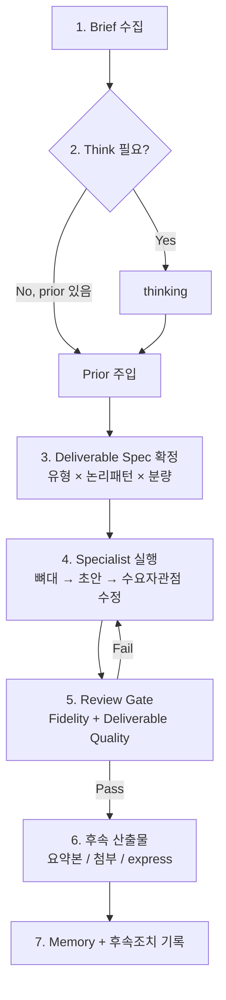

# Struct Deliverable System — Design Document

> **Summary**: Minto 팀을 "논리 구조화 엔진"에서 "유형화된 보고서 산출 시스템"으로 고도화하는 설계
>
> **Project**: logical-thinking (Struct Agent Team)
> **Date**: 2026-06-28
> **Status**: Phase 6 **완료** (2026-06-28) — Source Validation (출처·균형·다중 출처)
> **참고 자료**: `reference/president/대통령 보고서.md` + 유형별 PDF 예시 ([president/README.md](../reference/president/README.md))
> **우선순위 상세**: [struct-deliverable-template-priority.md](struct-deliverable-template-priority.md)

---

## Context Anchor

| Key | Value |
|-----|-------|
| **WHY** | 현재 팀은 생각을 논리적으로 구조화하는 수준에 머물러 있으며, 구조화된 개념을 수요자 맞춤 **유형화된 산출물**로 변환하는 운영 체계가 부족함 |
| **WHO** | Struct Agent Team 사용자 — 단독 의사결정·분석·문서 작성을 수행하는 개인 전문가 |
| **진단** | Minto(논리 축)는 강함 / 행정 보고서 운영(산출물 축)은 약함 — 두 축은 직교(orthogonal)하며 상호 보완 가능 |
| **SUCCESS** | Brief 수집 → 유형 선택 → 보고서 산출 → Review 통과까지 end-to-end 파이프라인 동작; 수요자 관점 품질 게이트 적용 |
| **SCOPE** | Orchestrator 워크플로우, Brief 체계, 유형 템플릿, Review 확장, Express 패키지화, Memory 스키마 (자료 수집 전담 agent는 P2) |

---

## 1. 현황 진단

### 1.1 현재 파이프라인

```
Raw Input → Minto Thinking → (논리 패턴 템플릿) → Markdown 산출물
```

| 단계 | 담당 | 강점 |
|------|------|------|
| think | thinking.md | coreClaim, MECE, Pyramid, Critique |
| write | writing.md | SCQA, Pyramid Consumption, 논리 패턴 템플릿 5종 |
| solve | problem-solving.md | 가설 기반 문제 분석 |
| express | expression.md | slide/memo/story 변환 |
| review | review.md | Pyramid Consumption Fidelity + Compliance (Tier 1~3) |
| orchestrator | orchestrator.md | 라우팅, Prior Injection, Review Gate |

### 1.2 목표 파이프라인

```
Raw Input
  → Brief (수요자·목적·유형)
  → Thinking (필요 시 / prior 재사용)
  → Deliverable Spec (유형 × 논리패턴 × 분량)
  → Specialist (뼈대 → 초안 → 수요자 관점 수정)
  → Review (Fidelity + Deliverable Quality)
  → 후속 산출물 (요약본 / 첨부 / express 패키지)
  → Memory + 후속조치 기록
```

### 1.3 두 축 모델

| 축 | 정의 | 현재 | 목표 |
|----|------|------|------|
| **논리 축 (Minto)** | coreClaim, MECE, SCQA, IAEJ/SER 등 전개 방식 | **강함** | 유지·강화 |
| **산출물 축 (행정 보고)** | 유형, 수요자, 절차, 품질 기준, 건의·후속조치 | **약함** | 신규 구축 |

**핵심 인사이트**

> Minto는 "논리가 맞는가?"를 검증한다.  
> 행정 보고서 가이드는 "결정권자가 한 번 보고 판단·조치할 수 있는가?"를 검증한다.

고도화의 본질: Orchestrator가 **라우터**에서 **보고서 운영 매니저**로 전환.

---

## 2. 참고 자료 분석 (대통령 보고서 작성 가이드)

### 2.1 보고서 4대 실패 유형 (Chapter 2)

Review 체크리스트로 이식 대상.

| # | 실패 유형 | 구체적 증상 |
|---|----------|------------|
| ① | 기본 틀 부재 | 양식·제목·목차·메타(누가/언제/왜) 누락, 논리 전개 뒤바뀜 |
| ② | 장황·초점 없음 | 모호한 표현, 주장 없는 견해 나열, 중복 설명 |
| ③ | 읽을수록 의문 | 과도한 압축, 배경·근거·용어 설명 부족, 출처 불명 |
| ④ | 문제의식 부재 | 현황·원인 분석 부족, 대안 나열에 그침, 수요자 조치 불명확 |

### 2.2 표준 4단계 절차 (Chapter 3)

| 단계 | 내용 | 현재 팀 매핑 | 갭 |
|------|------|-------------|-----|
| 1 | 목표·수요자·시기·틀 구상 | think 일부 | **수요자 프로파일·보고 시기 없음** |
| 2 | 자료 수집·분석·검증 | 없음 | **전담 단계 없음** |
| 3 | 뼈대→초안→수요자 관점 수정→교정 | write 내부 일부 | **3단계 미명시** |
| 4 | 보고·후속조치 | 없음 | **건의·후속조치 미체계화** |

### 2.3 보고서 유형 분류 (2부)

**목적 기반 유형** — 현재 논리 패턴 템플릿과 직교.

| 유형 | 정의 | 핵심 구조 |
|------|------|----------|
| 정책기획보고서 | 의사결정용 — 신규·변경 정책 | 개요 → 현황·문제 → 대안 → 추진계획 → 건의 |
| 조정과제보고서 | 추진 중 갈등·이해관계 조정 | 개요 → 현황·쟁점 → 대안분석 → 건의 → 향후계획 |
| 정책참고보고서 | 의사결정 불요, 참고자료 | 개요 → 현황·사례 → 시사점 |
| 상황보고서 | 시의성 강한 사실 전달 | 제목 → 도입문(5W) → 본문 → 결론(선택) |
| 정보보고서 | 이슈 분석·평가 | 상황보고 + 분석·대책 |
| 회의자료보고서 | 회의용 (정보공유/의견수렴/의사결정) | 경위 → 목적 → 안건 설명 |
| 회의결과보고서 | 회의 후 정리 | 개요 → 안건별 논의·결정 |
| 행사보고서 | 행사 기획·진행 | (기획/진행 분리) |

### 2.4 품질 원칙 (Chapter 4~6)

- **두괄식** + 필요 시 양괄식; 개조식 2~3줄 이내
- **제목**: 20자 이내, 내용·취지 포괄, 동작성 단어로 종결
- **서술형 개조식** 권장
- **요약본 + 상세본** 비율 1:5 (요약: 취지·결론 중심)
- **첨부·하이퍼링크**로 본문-부속 자료 연결
- **시각자료**: 표(비교), flowchart(흐름), 그래프(추세)

### 2.5 현재 팀과의 정합성 매트릭스

| 가이드 요소 | 현재 Struct Team | 정합도 |
|------------|-----------------|--------|
| 두괄식, 개조식, 표·도식 | Default Output Style, Pyramid Consumption | 높음 |
| 4단계 절차 | think → write → review | 중간 |
| 유형별 양식 | 논리 패턴 5종만 | 낮음 |
| 수요자 중심 설계 | Collaborative/Autonomous 모드만 | 중간 |
| "수요자가 할 일" 명시 | solve/write 결론 일부 | 중간 |
| 요약+상세 (1:5) | express (미구조화) | 낮음 |
| 출처·균형 검증 | review (Fidelity 중심) | 낮음 |

---

## 3. 목표 아키텍처

### 3.1 Orchestrator 워크플로우 (재설계)

#### 현재


#### 목표



**Orchestrator 신규 책임**

1. **Brief 수집·주입** — 모든 write/solve/express의 전제
2. **Deliverable Spec 확정** — 유형 + 논리패턴 + summaryDetailRatio
3. **Think 필요 판단** — prior 유무, 명령 유형, Brief 복잡도
4. **후속 산출물 트리거** — 요약본·express 패키지 자동 연계 (옵션)
5. 기존: Prior Injection, Review Gate, Memory — 유지·확장

**Orchestrator에 두지 않을 것** (Specialist 위임)

- Minto 6-Step 사고
- 본문 초안 작성·수정
- 자료 심층 분석 (P2 agent 또는 write 전처리)

### 3.2 Brief 스키마

Orchestrator가 수집하고 Context에 주입하는 블록.

```markdown
## Brief (Report Operations)
reportPurpose: {왜 지금 이 보고를 하는가 — 1~2문장}
audience: decision-maker | expert | meeting-participant | reference-only
deliverableType: policy-planning | coordination | policy-reference | situation | information | meeting-material | meeting-result | event
timing: urgent | normal
requestedAction: {수요자가 해야 할 일 — 결정/승인/건의/참고만/없음}
summaryDetailRatio: summary-only | split-1-5 | detail-only
logicPattern: auto | scqa-pattern | iaej-pattern | incident-causal-pattern | objective-policy-pattern | fabe-pattern | prep-pattern | case-measure-pattern
logicPatternMode: ser | stad   # incident-causal-pattern
```

**모드별 수집**

| 모드 | Brief 수집 방식 |
|------|----------------|
| Collaborative (기본) | Orchestrator가 필수 항목 질문 → 사용자 확인 후 주입 |
| Autonomous | User Input + memory에서 추론 → 결과 상단에 Brief 요약 1블록 표기 |

**audience별 조절 규칙 (Writing/Express에 전달)**

| audience | 분량 | 깊이 | 건의사항 | 용어 |
|----------|------|------|----------|------|
| decision-maker | 짧음 | 핵심만 | **필수** | 평이 |
| expert | 중~장 | 기술 상세 | 선택 | 전문용어 OK (정의 병기) |
| meeting-participant | 중 | 안건·쟁점 중심 | 회의 목적에 따름 | 평이 |
| reference-only | 장 | 사례·시사점 풍부 | 없음 | 균형·중립 |

### 3.3 Deliverable Spec 확정 로직

Orchestrator Step 3 — Specialist 호출 직전.

```
입력: Brief + (선택) Previous Thinking Pyramid
출력: ## Deliverable Spec 블록

1. deliverableType → 유형 템플릿 파일 선택 (`struct-docs/templates/deliverables/*.md`)
2. logicPattern:
   - auto → 유형 + pyramid 내용 분석 후 논리 패턴 자동 선택 (기존 writing 로직)
   - 명시 시 → 해당 패턴 강제
3. summaryDetailRatio → express 후속 여부 결정
4. requestedAction → 결론/건의 섹션 필수 여부 결정
```

### 3.4 템플릿 2차원 매트릭스

**유형 템플릿** = 섹션 골격 (무엇을 담을 것인가)  
**논리 패턴** = 섹션 내부 전개 (어떻게 논증할 것인가)

```
                    논리 패턴
                 SCQA  IAEJ  SER  STAD  ObjPol
유형  정책기획      ○     ○    ·    ·     ○
      조정과제      ○     ·    ○    ·     ·
      정책참고      ·     ·    ·    ·     ·
      상황보고      ·     ·    ·    ·     ·   (전용 양식)
      정보보고      ○     ·    ·    ·     ·
      회의자료      ○     ·    ·    ·     ○
      회의결과      ○     ·    ·    ·     ·
      행사          ·     ·    ·    ·     ○

○ = 권장 조합  · = 비권장/전용 양식 사용
```

**신규 템플릿 파일 (우선순위 확정)** — 상세: [struct-deliverable-template-priority.md](struct-deliverable-template-priority.md)

| Wave | 파일명 | 유형 | 우선순위 | Sprint |
|------|--------|------|---------|--------|
| 0 | (공통 메타 — 각 템플릿 상단) | 표지·제목·개요·첨부 | 선행 | 2a |
| 1 | `deliverable-policy-planning.md` | 정책기획 | **P0** | 2a |
| 2 | `deliverable-situation-info.md` | 상황·정보 (`subType` 분기) | **P0** | 2b |
| 3 | `deliverable-coordination.md` | 조정과제 | P1 | 2c ✅ |
| 4 | `deliverable-meeting-material.md` | 회의자료 (`meetingPurpose` 3변형) | P1 | 2d ✅ |
| 5 | `deliverable-meeting-result.md` | 회의결과 | P2 | 2e ✅ |
| 6 | `deliverable-policy-reference.md` | 정책참고 | P2 | 2e ✅ |
| 7 | `deliverable-event.md` | 행사기획·진행 | P3 | 2f ✅ |

**MVP**: Wave 1 + Wave 2 (정책기획 + 상황·정보)

논리 패턴(`templates/patterns/**/*.md`)은 deliverable의 `(logic: …)` 앵커 내부에 단계 구조를 제공한다. (deliverables는 thin profile, patterns가 Primary Logic Core)

### 3.5 Writing Agent 4단계 내부화 (W4 External Face)

참고자료 Chapter 3 3단계 + **W4 제출면 정리**. `submissionTarget: true`(기본) 시 Markdown 제출본.

| 단계 | 명칭 | 내용 | 산출물 흔적 |
|------|------|------|------------|
| W1 | 뼈대 (Skeleton) | 유형 템플릿 골격 + prior Level 1 매핑, placeholder 채움 | `draftStage: skeleton` |
| W2 | 초안 (Draft) | 문장·표·도식 구체화, 논리 패턴 적용 | `draftStage: draft` |
| W3 | 수요자 관점 수정 (Audience Pass) | Brief.audience 기준 점검 — 장황함 제거, 건의 명확화, 용어 조절 | `draftStage: audience-revised` (Working 섹션) |
| W4 | 제출면 정리 (External Face) | ST1~ST6 · Working 제거 · 표지 메타 정리 | `draftStage: submission-ready`, `submissionReady: true` |

`submissionTarget: false` → W3까지만 (Working 포함).  
체크리스트: `reference/submission-ready-checklist.md` · 구분: `shared/submission-vs-working.md`

Collaborative: W1·W2·W3 후 확인; W4 제출본 미리보기  
Autonomous: W1~W4 연속 실행; `submissionTarget: true` 시 **제출본만** 저장 (frontmatter에 stage)

**수요자 관점 수정 체크리스트 (W3)**

- "수요자가 요구·궁금한 것을 해소했는가?"
- "객관적·설득력 있게 작성했는가?"
- "불명확한 표현·중복·피동형은 없는가?"
- (정책·조정 유형) "수요자 조치 사항이 명확한가?"

### 3.6 Review Agent 확장

기존 **Fidelity + Compliance**에 **Deliverable Quality** 게이트 추가.  
**Wave 2 DT-Submission**: `submissionTarget: true` write 산출물에 ST1~ST6 재검 · Review Data `submissionReady`. express Package는 `submissionReady: pass` 후만.

#### 검증 유형 확장

| Verification Type | 대상 | 시점 |
|-------------------|------|------|
| thinking-compliance | think 산출물 | think 후 |
| writing-consumption | prior 소비 충실도 | write 후 (prior 사용 시) |
| deliverable-quality | Brief·유형·4대 실패 유형 | write/solve/express 후 |
| both | consumption + deliverable | write 후 (권장 기본) |
| fidelity | (기존) pyramid ↔ 산출물 | prior 있을 때 |

#### Deliverable Quality Tier

| Tier | 검증 대상 | 강도 | 예시 |
|------|----------|------|------|
| **T1** | Non-negotiables + 수요자 필수 | 매우 엄격 | 정책기획인데 건의 없음; 제목이 내용 미반영; Brief.requestedAction 미충족 |
| **T2** | 4대 실패 유형 | 중간 | 배경 누락; 근거 부족; 장황·중복; 실행계획 없음 |
| **T3** | 표현 품질 | 관대 | 문장 3줄 초과; 능동형 미사용; 소제목 부족 |

기존 `force_rework` / Orchestrator 재호출 규칙은 **Deliverable T1 위반**에도 동일 적용.

### 3.7 Express Agent 재정의

역할: "포맷 변환" → **산출물 패키지 생성**

```
Full Report (struct-write 산출물)
├── Executive Brief     — summaryDetailRatio=split-1-5 시 (1:5 요약)
├── Meeting Slide Deck  — meeting-material 후속 시
└── Attachments Index   — 첨부·참고자료 목차 + 하이퍼링크
```

**Executive Brief 규칙** (Chapter 6)

- 보고 취지 + 결론 중심
- 세부는 Full Report 참조 링크
- 분량: Full Report의 약 1/5

**express 호출 트리거**

- Brief.summaryDetailRatio = `split-1-5` → write Review pass 후 자동 (Autonomous) 또는 확인 (Collaborative)
- 명시적 `/struct-express brief {경로}`

### 3.8 Memory 스키마 확장

`.struct-memory.json`에 `briefs` 배열 추가.

```json
{
  "briefs": [
    {
      "id": "{timestamp}",
      "timestamp": "{ISO 8601}",
      "reportPurpose": "...",
      "audience": "decision-maker",
      "deliverableType": "policy-planning",
      "logicPattern": "iaej-pattern",
      "requestedAction": "예산 승인 건의",
      "summaryDetailRatio": "split-1-5",
      "linkedDocument": "struct-docs/02-writing/..."
    }
  ],
  "previousThoughts": [],
  "previousDocuments": [],
  "previousReviews": []
}
```

동일 주제 후속 write 시 Brief 재사용·증분 수정 가능 (S05 Cross-session Prior Reuse 패턴 확장).

### 3.9 책임 분리 원칙

| 커맨드 | 핵심 질문 | 책임 |
|--------|----------|------|
| `/struct-think` | 무엇이 맞는가? | 순수 피라미드 (변경 최소) |
| `/struct-write` | 무엇을 낼 것인가? | Brief + 유형 + 패턴 → 보고서 |
| `/struct-solve` | 어떻게 해결할 것인가? | Brief 반영 문제 해결안 |
| `/struct-express` | 어떻게 전달할 것인가? | 요약·슬라이드·패키지 |
| `/struct-review` | 수요자가 쓸 수 있는가? | Fidelity + Deliverable Quality |

---

## 4. 구현 Phase

전면 적용하되, 의존성 순서로 단계 분리.

| Phase | 내용 | 변경 대상 | 완료 기준 |
|-------|------|----------|----------|
| **1** | Brief 수집 + Context 주입 + Memory 스키마 | `orchestrator.md`, skills, `.struct-memory.json` 구조, `workflow.mmd` | ✅ write/solve/express 시 Brief·Deliverable Spec 주입 |
| **2** | 유형 템플릿 (Wave 0~4, MVP=Wave 1~2) + README 매트릭스 | `struct-docs/templates/deliverables/`, `templates/README.md` | ✅ MVP: policy-planning · situation-info available |
| **3** | Writing 4단계 (W1→W2→W3→W4) | `writing.md`, `struct-docs/usage/write.md`, `submission-ready-checklist.md` | submission-ready 제출본 (Working 제거) |
| **4** | Review Deliverable Quality | `review.md`, `struct-review/SKILL.md`, `usage/review.md` | 4대 실패 유형 Tier 1~3 검증 |
| **5** | Express 패키지 (1:5 Brief) | `expression.md`, `orchestrator.md` 후속 트리거 | Full + Executive Brief 연계 산출 |
| **6** | 자료 검증 | 신규 agent 또는 write 전처리 | 출처·균형·다중 출처 확인 체크리스트 |

**Phase 1~4**만으로 "구조화 → 유형화된 보고서" 전환 체감 가능.

---

## 5. 변경 파일 목록 (전체)

### 5.1 필수 변경

| 파일 | Phase | 변경 요약 |
|------|-------|----------|
| `.claude/agents/orchestrator.md` | 1, 5 | Brief 단계, Deliverable Spec, express 후속 트리거 |
| `.claude/agents/writing.md` | 2, 3 | 유형 템플릿 선택, W1~W3 절차 |
| `.claude/agents/review.md` | 4 | deliverable-quality 검증, 4대 실패 유형 |
| `.claude/agents/expression.md` | 5 | Executive Brief, Attachments Index |
| `.claude/skills/struct-write/SKILL.md` | 1, 2 | Brief 옵션, 유형 힌트 |
| `.claude/skills/struct-review/SKILL.md` | 4 | verification type 확장 |
| `struct-docs/templates/README.md` | 2 | 2차원 매트릭스, 유형 템플릿 표 |
| `struct-docs/usage/workflow.mmd` | 1 | 목표 워크플로우 반영 |
| `struct-docs/usage/write.md` | 2, 3 | Brief·유형·3단계 사용법 |
| `struct-docs/usage/review.md` | 4 | Deliverable Quality 설명 |
| `struct-docs/usage/express.md` | 5 | 패키지 산출 설명 |
| `Claude.md` | 1 | 아키텍처 요약 업데이트 |

### 5.2 신규 생성

| 파일 | Phase |
|------|-------|
| `docs/struct-deliverable-template-priority.md` | — | 우선순위 확정 문서 |
| `reference/president/README.md` | — | PDF·가이드 인덱스 |
| `struct-docs/templates/deliverables/deliverable-policy-planning.md` | 2a (P0) |
| `struct-docs/templates/deliverables/deliverable-situation-info.md` | 2b (P0) |
| `struct-docs/templates/deliverables/deliverable-coordination.md` | 2c (P1) |
| `struct-docs/templates/deliverables/deliverable-meeting-material.md` | 2d (P1) |
| `struct-docs/templates/deliverables/deliverable-meeting-result.md` | 2e (P2) |
| `struct-docs/templates/deliverables/deliverable-policy-reference.md` | 2e (P2) |
| `struct-docs/templates/deliverables/deliverable-event.md` | 2f ✅ |

### 5.3 선택 변경 (Phase 6)

| 파일 | 변경 요약 |
|------|----------|
| `.claude/agents/research.md` (신규) | 자료 수집·검증 전담 |
| `.claude/skills/struct-research/SKILL.md` (신규) | `/struct-research` 커맨드 |

---

## 6. 리스크와 완화

| 리스크 | 영향 | 완화 |
|--------|------|------|
| Orchestrator 비대화 | 유지보수 어려움 | Brief·Spec은 Orchestrator, 본문은 Specialist 엄격 분리 |
| 템플릿 폭발 | 선택 혼란 | 1차 유형 4종 + auto logicPattern; README가 source of truth |
| Review 과부하 | 재생성 루프 증가 | Tier로 강도 조절; Deliverable T3는 권고만 |
| Collaborative Brief 질문 과다 | UX 저하 | 필수 3항목만 질문 (purpose, audience, type) — 나머지 추론 |
| 기존 워크플로우 호환 | 기존 사용자 혼란 | Brief 없으면 `scqa-pattern` + audience=expert 폴백 |
| 자료 검증 무거움 | Phase 6으로 분리 | 1~5단계는 사용자 제공 자료 + 체크리스트만 |

---

## 7. Orchestrator Context 주입 형식 (목표)

Specialist 호출 시 프롬프트 구조 (Phase 1 완료 후).

```markdown
## Task
{command} 수행

## User Input
{사용자 원본 텍스트}

## Mode
{collaborative | autonomous}

## Brief (Report Operations)
{Brief 블록 전체}

## Deliverable Spec
deliverableTemplate: struct-docs/templates/deliverables/deliverable-policy-planning.md
logicPattern: iaej-pattern
writingStages: skeleton → draft → audience-revised → submission-ready
submissionTarget: true
summaryDetailRatio: split-1-5

## Previous Thinking Pyramid (해당 시)
{기존 Prior 블록}

## Review Feedback (재생성 시)
{기존 Review Feedback 블록}

## Output Requirements
- Markdown + Frontmatter
- 사용 템플릿·유형·패턴 명시
- 저장: struct-docs/{category}/{filename}.md
```

---

## 8. 미결정 사항 (구현 전 확정 필요)

| # | 항목 | 옵션 | 권장 |
|---|------|------|------|
| 1 | Brief 필수 여부 | always / write·express만 / optional | write·solve·express만 필수; think는 선택 |
| 2 | 유형 템플릿 파일명 규칙 | `deliverable-*` vs `type-*` | `deliverable-{kebab}.md` (기존 pattern 네이밍과 구분) |
| 3 | Phase 1 Collaborative 질문 수 | 3항목 / 5항목 / 전체 | 3항목 필수 + 나머지 추론 |
| 4 | express 자동 트리거 | write 후 항상 / split-1-5만 / 수동만 | split-1-5 + 사용자 opt-in |
| 5 | solve에 Brief 적용 범위 | 전체 / requestedAction만 | 전체 (문제 프레이밍에 audience 반영) |
| 6 | 첫 구현 유형 우선순위 | — | **확정**: 정책기획 + 상황·정보 통합 (MVP). [상세](struct-deliverable-template-priority.md) |
| 7 | 상황/정보 템플릿 분리 | 통합 / 분리 | **확정**: `deliverable-situation-info.md` 단일 파일 + `subType` 분기 |
| 8 | 행사 템플릿 | 즉시 / 보류 | **확정**: P3 보류 (가이드 Ch.5 미완) |

---

## 9. 성공 지표 (구현 후 검증)

| 지표 | 측정 방법 | 목표 |
|------|----------|------|
| Brief 주입률 | write/solve/express 호출 중 Brief 블록 포함 비율 | >95% |
| 유형 템플릿 적용률 | 산출물 frontmatter `deliverableType` 기록 | 명시적 write의 100% |
| Deliverable Review pass | deliverable-quality T1 위반 0건 후 저장 | 1차 재생성 후 >90% |
| 요약·상세 패키지 | split-1-5 요청 시 Brief + Full 동시 존재 | 100% |
| 수요자 조치 명시 | policy-planning/coordination 건의 섹션 존재 | T1 기준 100% |

---

## 10. 관련 문서

| 문서 | 경로 | 관계 |
|------|------|------|
| 팀 개요 | `Claude.md` | 구현 후 동기화 |
| 현재 워크플로우 | `struct-docs/usage/workflow.mmd` | Phase 1에서 교체 |
| 논리 패턴 템플릿 | `struct-docs/templates/README.md` | 2차원 매트릭스 확장 |
| Orchestrator 정의 | `.claude/agents/orchestrator.md` | Phase 1 핵심 |
| 참고 원문 | `reference/president/대통령 보고서.md` | 산출물 축 source |
| 참고 인덱스 | `reference/president/README.md` | PDF gold example 14건 |
| 템플릿 우선순위 | `docs/struct-deliverable-template-priority.md` | Wave·MVP·평가 기준 확정 |
| 기존 팀 설계 | `docs/archive/2026-06/minto-agent-team/minto-agent-team.design.md` | 논리 축 기반 설계 (본 문서가 확장) |

---

## 11. 요약

- **진단**: Minto 팀 = 논리 구조화 엔진 (강점) / 유형화 산출물 운영 (갭)
- **방향**: 참고자료의 수요자·유형·절차·품질 기준을 Orchestrator 중심으로 통합
- **핵심 변경**: Brief → Deliverable Spec → 3단계 Writing → 이중 Review → Express 패키지
- **구현**: Phase 1(Brief+Orchestrator)부터 — 없으면 나머지 효과 반감
- **원칙**: Think=논리 / Write=산출물 / Review=수요자 소비 가능성

---

## Phase 1 완료 체크리스트 (2026-06-28)

- [x] `reference/deliverable-brief-schema.md` — Brief·Deliverable Spec·memory 스키마
- [x] `.claude/agents/orchestrator.md` — Brief 수집, Deliverable Spec, briefs memory
- [x] `.claude/agents/writing.md` — Brief & Deliverable Spec 소비
- [x] `.claude/agents/problem-solving.md` — Brief 소비
- [x] `.claude/agents/expression.md` — Brief 소비
- [x] `.claude/skills/struct-write|solve|express/SKILL.md` — Brief 옵션
- [x] `.struct-memory.json` — `briefs`, `previousReviews`, `defaultAudience`
- [x] `struct-docs/usage/workflow.mmd` — Brief 단계 반영
- [x] `struct-docs/usage/write|solve|express|index.md`, `Claude.md` — 문서 동기화
- [x] `reference/README.md` — 활성 참조 등록

## Phase 2 MVP 체크리스트 (2026-06-28)

- [x] `deliverable-policy-planning.md` — 정책기획 5단 골격 + Pyramid 매핑 가이드
- [x] `deliverable-situation-info.md` — 상황·정보 subType 분기
- [x] `templates/README.md` — deliverable 표 + 2축 선택 규칙
- [x] `writing.md`, `orchestrator.md` — available 템플릿 연동

- [x] `deliverable-coordination.md` — 쟁점 대비표·장단점·선정 이유

- [x] `deliverable-meeting-material.md` — meetingPurpose 3변형 (info-share / opinion-gathering / decision)

- [x] `deliverable-meeting-result.md` — 안건별 결정·제3자 서술
- [x] `deliverable-policy-reference.md` — 사례·시사점 (건의 없음)

- [x] `deliverable-event.md` — eventPhase planning/progress (Ch.5 PDF 기반)

## Phase 3 체크리스트 (2026-06-28)

- [x] `writing.md` — § Writing Pipeline (Phase 3): W1 Skeleton · W2 Draft · W3 Audience Pass
- [x] `writing.md` — Output Requirements: `draftStage`, `writingPipeline`, `## Audience Pass`
- [x] `orchestrator.md` — Deliverable Spec `writingStages` (write 전용)
- [x] `reference/deliverable-brief-schema.md` — writingStages 필드
- [x] `struct-docs/usage/write.md` — 3단계 사용법
- [x] `struct-docs/usage/workflow.mmd` — WritingDetail W1~W3 서브그래프
- [x] `struct-write/SKILL.md` — Pipeline 언급
- [x] `Claude.md` — Phase 3 아키텍처 요약

## Phase 3b — Submission-Ready (W4, 2026-06-28)

- [x] `reference/submission-ready-checklist.md` — ST1~ST6 · W4 제거 목록
- [x] `shared/submission-vs-working.md` — Submission vs Working 구분
- [x] `writing.md` — W4 External Face · Output Requirements (제출본)
- [x] `orchestrator.md` — `submissionTarget` · W4 writingStages
- [x] `deliverable-brief-schema.md` — `submissionTarget` 필드
- [x] `struct-docs/usage/write.md` · `struct-write/SKILL.md` — submission-target 옵션
- [x] `reference/README.md` — checklist 등록
- [x] Review DT-Submission (`submissionReady` 게이트) — Wave 2
- [x] `review.md` — DT-Submission ST1~ST6 · Review Data `submissionReady`
- [x] `orchestrator.md` — R4 W4 rework · express `submissionReady` 선행 게이트
- [x] `struct-docs/usage/review.md` · `struct-review/SKILL.md` · `expression.md` 동기화

## Phase 4 체크리스트 (2026-06-28)

- [x] `review.md` — Deliverable Quality Model (F1~F4, DT1~DT3) + Verification Type 확장
- [x] `review.md` — Deliverable Quality Report · Review Data `deliverableQuality` / `deliverableTiers`
- [x] `orchestrator.md` — Review Gate Brief 복원 · verification 기본값 · DT1 force_rework · Review Feedback.deliverable
- [x] `struct-review/SKILL.md` — verification 옵션 · deliverable 기본 시점
- [x] `struct-docs/usage/review.md` — 4대 실패 유형 · 검증 유형 표
- [x] `Claude.md` — review 책임 업데이트

## Phase 5 체크리스트 (2026-06-28)

- [x] `express-executive-brief.md` · `express-meeting-slide-deck.md` · `express-attachments-index.md`
- [x] `expression.md` — § Express Package, packageMode, 1:5 규칙, Full Report Source
- [x] `orchestrator.md` — Step EP 후속 트리거 (split-1-5 · meeting-material · 모드별)
- [x] `struct-express/SKILL.md` — brief/package 문법·옵션
- [x] `struct-docs/usage/express.md` — 패키지 사용법
- [x] `templates/README.md` · `deliverable-brief-schema.md` §6 · `workflow.mmd` · `Claude.md`

## Phase 6 체크리스트 (2026-06-28)

- [x] `reference/source-validation-checklist.md` — S1~S5 · ST1~ST3 · Context 형식
- [x] `.claude/agents/research.md` — Claim–Source Catalog · Source Validation Report
- [x] `.claude/skills/struct-research/SKILL.md` — `/struct-research` 커맨드
- [x] `orchestrator.md` — research 라우팅 · research-first · `previousResearch` memory
- [x] `writing.md` · `problem-solving.md` — Source Validation 소비
- [x] `review.md` — `source-quality` · `deliverable+source` verification
- [x] `struct-docs/usage/research.md` · `workflow.mmd` · `Claude.md` · `index.md`

**Deliverable System Phase 1~6 구현 완료.**

---

*본 문서는 2026-06-28 대화에서 도출된 설계 합의를 기록합니다.*