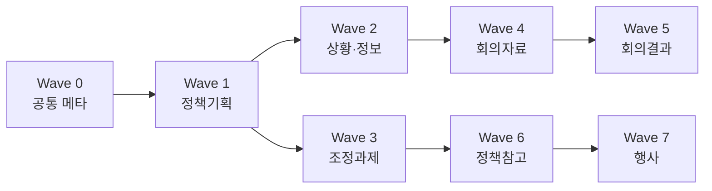

# Deliverable 템플릿 우선순위 선정

> **기준 문서**: `reference/president/대통령 보고서.md`  
> **예시 자료**: `reference/president/*.pdf`  
> **상위 설계**: [struct-deliverable-system.design.md](struct-deliverable-system.design.md)  
> **Date**: 2026-06-28  
> **Status**: 확정 (Phase 2 구현 순서 기준)

---

## 1. 선정 목적

- Struct Agent Team이 **논리 구조화(think)** 결과를 **유형화된 산출물(write)** 로 변환할 때, 어떤 `deliverable-*.md` 템플릿을 **어떤 순서로** 구현할지 결정한다.
- 유형 템플릿(산출물 축)과 논리 패턴 템플릿(논리 축)은 **직교** — 본 문서는 **유형 템플릿만** 대상으로 한다.

---

## 2. 평가 기준 (5점 척도)

| 코드 | 기준 | 의미 |
|------|------|------|
| **A** | Pipeline 적합도 | `/struct-think` 피라미드 → 해당 유형 섹션 매핑이 자연스러운가 |
| **B** | 갭 심각도 | 기존 `report-default.md`로 커버되지 않는 정도 |
| **C** | 가이드·예시 완성도 | `대통령 보고서.md` 상세도 + PDF 실물 예시 유무 |
| **D** | 범용성 | 개인 전문가(의사결정·분석·문서) 일상 사용 빈도 |
| **E** | 구현 복잡도 (역점수) | 섹션 수·하위 변형·검증 규칙 — 높을수록 구현 부담 ↑ |

**종합점** = A + B + C + D + (6 − E)  
(E: 1=단순 … 5=복잡 → 역산하여 단순할수록 가산)

---

## 3. 유형별 평가

| 유형 | A | B | C | D | E(복잡) | 종합 | PDF 예시 |
|------|---|---|---|---|---------|------|----------|
| **정책기획** | 5 | 5 | 5 | 5 | 4 | **21** | 2건 |
| **상황·정보** | 4 | 5 | 5 | 4 | 2 | **22** | 3건 |
| **조정과제** | 4 | 4 | 4 | 3 | 4 | **17** | 1건 |
| **회의자료** | 3 | 4 | 4 | 4 | 3 | **16** | 2건 |
| **회의결과** | 2 | 4 | 4 | 3 | 2 | **15** | 2건 |
| **정책참고** | 3 | 3 | 3 | 3 | 2 | **14** | 1건 |
| **행사** | 2 | 3 | 2 | 2 | 3 | **10** | 2건 |

### 유형별 요약 판단

| 유형 | 핵심 근거 |
|------|----------|
| **정책기획** | 고도화 목표의 중심 — 건의·추진계획·정책대상이 `report-default`에 없음. think Level 1 → 섹션 2·3 매핑이 직관적 |
| **상황·정보** | 양식이 SCQA와 **완전히 다름**(제목·도입문 5W·신속간결). 산출물 축 전환을 가장 명확히 증명. 구현은 상대적으로 단순 |
| **조정과제** | 정책기획과 60% 공통 — **정책기획 이후** 파생 구현이 효율적. 쟁점 대비표가 차별점 |
| **회의자료** | 실무 빈도 높음. 정보공유/의견수렴/의사결정 3하위변형 필요 |
| **회의결과** | 입력이 회의록(think 산출물과 다른 소스). 구현은 쉬우나 파이프라인 연계는 약함 |
| **정책참고** | 건의 없음·시사점 중심 — think 후속 참고용. 긴급도 낮음 |
| **행사** | 가이드 본문(Ch.5) **미완** — PDF만 존재. 후순위 |

---

## 4. 확정 우선순위 (Implementation Waves)

### Wave 0 — 공통 메타 (선행, 단독 파일 아님)

모든 deliverable 템플릿 상단에 공통 삽입.

| 항목 | 출처 | 필수 |
|------|------|------|
| 표지 메타 (제목, 작성일, 작성자, 목적 한 줄) | Ch.3 §4, Ch.4 §1 | T1 |
| 제목 규칙 (20자 이내, 동작성 종결) | Ch.4 §1, Ch.3 상황·정보 | T1 |
| 개요 (결론 포함, 본문 반복 금지) | Ch.4 §2 | T2 |
| 첨부·참고자료 블록 | Ch.6 | T3 |

**참고 PDF**: `대통령비서실 보고서의 표준 용지 양식.pdf`, `항목부호 체계.pdf`, `항목부호 위치.pdf`

---

### Wave 1 — `deliverable-policy-planning.md` 【P0】

| 항목 | 내용 |
|------|------|
| **우선순위** | 1순위 — **첫 구현 템플릿** |
| **가이드 섹션** | Ch.2 정책기획 §1~5 |
| **골격** | 보고 개요 → 현황과 문제점 → 정책수단과 대안 → 추진계획 → 건의와 제안 |
| **기본 논리 패턴** | `iaej-pattern` (원인·판단), 대안 섹션은 `report-default` SCQA |
| **think 매핑** | coreClaim→건의 요지 / Level1→현황·대안 근거 / GPS표→대안 비교표 |
| **Review T1** | `requestedAction`·건의 섹션 필수 (audience=decision-maker) |
| **PDF gold** | `정책기획보고서1_청년실업 원인분석 보고.pdf`, `정책기획보고서2_OO시스템실용성제고방안.pdf` |

**선정 이유**: 4대 실패 유형 ④(수요자 조치 불명)를 해소하는 대표 유형. Minto→보고서 운영 시스템 전환의 **기준선**.

---

### Wave 2 — `deliverable-situation-info.md` 【P0】

| 항목 | 내용 |
|------|------|
| **우선순위** | 1순위 (정책기획과 **병렬** 구현 가능) |
| **가이드 섹션** | Ch.3 상황·정보보고서 |
| **골격** | 제목 → 도입문(5W) → 본문 → 결론(선택) |
| **하위 변형** | `subType: situation \| information` (단일 파일 내 분기) |
| **기본 논리 패턴** | 전용 양식 — 논리 패턴 템플릿 **미적용** |
| **think 매핑** | 약함 — fact-first 산출. think prior는 본문 근거 보강용으로만 |
| **Review T1** | 제목·도입문 5W(who→when→where→what) 필수 |
| **PDF gold** | `상황보고서1_집중호우관련 상황보고.pdf`, `상황보고서2_주요 국정상황.pdf`, `정보보고서_OOO OOO활동실태.pdf` |

**상황 vs 정보 분기 규칙**

| subType | 시급성 | 결론 | 분석 깊이 |
|---------|--------|------|----------|
| `situation` | urgent | 생략 가능 | 사실·현황 중심 |
| `information` | normal | 대책·평가 권장 | 단일 주제 분석 |

**선정 이유**: SCQA와 **양식이 완전히 다름** — "유형화 산출물" 전환을 가장 빨리 체감. 구현 난이도 낮음.

---

### Wave 3 — `deliverable-coordination.md` 【P1】

| 항목 | 내용 |
|------|------|
| **우선순위** | 2순위 — **정책기획 이후** |
| **가이드 섹션** | Ch.2 조정과제 |
| **골격** | 보고 개요 → 현황과 쟁점 → 대안분석 → 건의와 제안 → 향후 계획 |
| **정책기획과 차이** | §2 쟁점 대비표, §3 장단점 분석표, 추진계획 축소 |
| **기본 논리 패턴** | `structure-event-response-pattern` (쟁점·조정 맥락) |
| **재사용** | Wave 1의 보고 개요·건의 블록 **공유** |
| **PDF gold** | `조정과제보고서_OO사업점검결과 및 조정방향 보고.pdf` |

---

### Wave 4 — `deliverable-meeting-material.md` 【P1】

| 항목 | 내용 |
|------|------|
| **우선순위** | 2순위 |
| **가이드 섹션** | Ch.4 회의자료 |
| **골격** | 회의 경위 → 회의 목적 → 회의 안건 설명 (+ 참고자료) |
| **하위 변형** | `meetingPurpose: info-share \| opinion-gathering \| decision` |
| **기본 논리 패턴** | `objective-policy-pattern` (목적-방침 쌍) |
| **express 연계** | 슬라이드 덱 자동 생성 후보 (시간 제약) |
| **PDF gold** | `회의자료보고서1_중소기업 정책정보 전달체계 혁신방안 추진.pdf`, `회의자료보고서2_상반기 중소기업 현장체험단 실적 및 계획.pdf` |

---

### Wave 5 — `deliverable-meeting-result.md` 【P2】

| 항목 | 내용 |
|------|------|
| **우선순위** | 3순위 |
| **골격** | 회의 개요 → 안건별 논의·결정·주요 의견 |
| **입력 특성** | think 피라미드보다 **회의록·메모** 입력이 자연스러움 |
| **Review T1** | 제3자적·객관적 서술 (작성자 주관 배제) |
| **PDF gold** | `회의결과보고서1_과학기술자문회의 보고결과.pdf`, `회의결과보고서2_제32회 국무회의 주요내용.pdf` |

---

### Wave 6 — `deliverable-policy-reference.md` 【P2】

| 항목 | 내용 |
|------|------|
| **우선순위** | 3순위 |
| **골격** | 보고 개요 → 현황·사례 → 시사점 |
| **특징** | 건의 **없음**, 분량 제한 없음, 사례·전문가 의견 풍부 |
| **think 매핑** | Level 1 → 시사점 근거, 사례는 첨부 확장 |
| **PDF gold** | `정책참고보고서_독일노동시장개혁방안 검토보고.pdf` |

---

### Wave 7 — `deliverable-event.md` 【P3 · 보류】

| 항목 | 내용 |
|------|------|
| **우선순위** | 4순위 (요구 확인 후) |
| **상태** | 가이드 Ch.5 본문 **미작성** — PDF 2건만 존재 |
| **분리 검토** | `deliverable-event-planning.md` / `deliverable-event-progress.md` |
| **PDF gold** | `행사기획보고서_정부 업무관리시스템.pdf`, `행사진행보고서_정부업무관리시스템 참고자료.pdf` |

**보류 조건 해제**: 가이드 보완 또는 사용자 시나리오 명시적 요청 시 착수.

---

## 5. 상황·정보 통합 vs 분리 결정

| 옵션 | 장점 | 단점 | **결정** |
|------|------|------|----------|
| 통합 (`deliverable-situation-info.md`) | 골격 동일, 유지보수 단순 | subType 분기 로직 필요 | **채택** |
| 분리 (2파일) | 선택 로직 단순 | 중복 70% | 기각 |

가이드 Ch.3도 동일 장에서 다루며, 제목·도입문·본문 구조가 같고 **결론 유무·분석 깊이**만 다름.

---

## 6. 2차원 매트릭스 (확정판)

논리 패턴 = 유형 템플릿 **섹션 내부** 전개. `·` = 전용 양식(논리 패턴 미적용).

| deliverableType | report-default | iaej | SER | STAD | objective-policy |
|-----------------|:--------------:|:----:|:---:|:----:|:----------------:|
| policy-planning | ○ (대안) | **◎** | · | · | ○ (추진계획) |
| situation-info | · | · | · | · | · |
| coordination | ○ | · | **◎** | · | · |
| meeting-material | ○ | · | · | · | **◎** |
| meeting-result | **◎** | · | · | · | · |
| policy-reference | · | · | · | · | · |
| event | · | · | · | · | ○ |

◎ = 1차 권장, ○ = 섹션별 선택

---

## 7. Phase 2 구현 일정 (설계 문서 연동)

| 구현 스프린트 | Wave | 산출물 | 예상 파일 |
|--------------|------|--------|----------|
| **Sprint 2a** | 0 + 1 | 공통 메타 + 정책기획 | `deliverable-policy-planning.md` |
| **Sprint 2b** | 2 | 상황·정보 | `deliverable-situation-info.md` |
| **Sprint 2c** | 3 | 조정과제 | `deliverable-coordination.md` |
| **Sprint 2d** | 4 | 회의자료 | `deliverable-meeting-material.md` |
| **Sprint 2e** | 5~6 | 회의결과 + 정책참고 | 2파일 |
| **Sprint 2f** | 7 | 행사 (조건부) | 1~2파일 |

**MVP (Minimum Viable Deliverable)**: Sprint 2a + 2b 완료 시  
→ 의사결정 보고(정책) + 신속 브리핑(상황·정보) 커버.

---

## 8. Fallback 규칙 (템플릿 미구현 시)

| 상황 | 동작 |
|------|------|
| Brief.deliverableType 미지정 | `report-default.md` + audience=expert |
| 유형 지정했으나 템플릿 파일 없음 | 해당 Wave 미완 안내 + **가장 가까운 구현된 유형** 제안 |
| 상황·정보인데 policy 템플릿 오매칭 | Review T1: 제목·도입문 5W 누락으로 fail → 재라우팅 |

---

## 9. reference/president 자료 활용 규칙

| 용도 | 파일 | 시점 |
|------|------|------|
| 템플릿 skeleton 설계 | `대통령 보고서.md` | 구현 시 Read |
| 섹션·표지·항목부호 | `대통령비서실 보고서의 표준 용지 양식.pdf`, `항목부호 체계.pdf` | Wave 0 |
| Gold example (품질 기준) | 유형별 PDF | Review rubric · gold-examples 후보 |
| 런타임 자동 Read | **미포함** (Phase 2 완료 후 `reference/president/gold/` 요약 md 추출 검토) |

에이전트 런타임 참조는 **요약된 markdown 템플릿**만 사용. PDF 원본은 개발·검증 시 human/agent가 선택적으로 Read.

---

## 10. 미결정 → 확정

| # | 항목 | 확정 |
|---|------|------|
| 1 | 첫 구현 유형 | **정책기획** (주력) + **상황·정보** (병렬) |
| 2 | 상황/정보 분리 | **통합** (`subType` 분기) |
| 3 | 행사 템플릿 | **Sprint 2f 완료** (PDF·제목 예시 기반, Ch.5 본문 미완 주석) |
| 4 | MVP 범위 | Wave 1 + Wave 2 |
| 5 | 조정과제 시점 | 정책기획 **이후** (섹션 재사용) |

---

## 11. 구현 상태 (2026-06-28)

| Sprint | 상태 | 산출물 |
|--------|------|--------|
| 2a | ✅ | `deliverable-policy-planning.md` |
| 2b | ✅ | `deliverable-situation-info.md` |
| 2c | ✅ | `deliverable-coordination.md` |
| 2d | ✅ | `deliverable-meeting-material.md` |
| 2e | ✅ | `deliverable-meeting-result.md`, `deliverable-policy-reference.md` |
| 2f | ✅ | `deliverable-event.md` |

## 12. 다음 액션

1. **Phase 2 완료** — deliverable 7종 전부 available
2. **Phase 3 완료** — Writing W1→W2→W3 (`writing.md`, `usage/write.md`)
3. **Phase 4 완료** — Review deliverable-quality (`review.md`, `usage/review.md`)
4. **Phase 5 완료** — Express Package (`expression.md`, `express-*.md`)
5. **Phase 6 완료** — Source Validation (`research.md`, `source-validation-checklist.md`)

---

*본 우선순위는 reference/president 실물 예시 14건 + 가이드 본문 완성도를 기준으로 2026-06-28 확정하였다.*