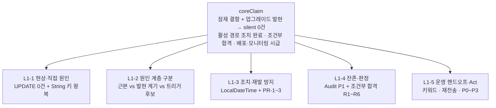

## CS 분석 (범주·요점)

### 범주 1: 장애 현상 (Silent Failure)
- 요점: Central 전송 성공 후에도 `IMG_CLCT_INFO_TB.CNT_SEND_CNT` UPDATE **0건** (SQLException 없음)
- 기대: 성공=5 / 실패=9 / 필수값누락=10 · 관측: DB `…34.074` vs Java String `…34.73000` → WHERE 불일치
- 경로: `AiInspectionSendScheduler` → `NInspectionInteractor` → Central 전송 → `updateAIInspectionResultStcd/Fail/Empty`

### 범주 2: 원인 계층 (직접 / 근본 / 발현 계기 / 트리거 후보)
- 요점: **직접** = String 키를 UPDATE WHERE `=` 재사용 · **근본(잠재 결함)** = `DATETIME(3)` 문자열 동등성 의존 설계 · **발현 계기** = SB 3.2.4→4.0.6 업그레이드 배포 · **유력 트리거 후보** = MariaDB Connector/J (실험 미수행, MyBatis 단독 확정 불가)

### 범주 3: 조치 · 재발 방지 (Do PR-1~3)
- 요점: 키 필드 `LocalDateTime` 전환 + 전송용 String 이중 매핑 유지 · Mapper int 반환 · ZERO_ROW/MULTI_ROW 관측 · rules/incident 제도화 · T1~T7 통과

### 범주 4: 전수검사 · 잔존 범위
- 요점: 활성 경로 P0 3 UPDATE 완료 · P1 레거시 Te\* 2건 잔존(호출 0) · P2 관찰 · Non-Goal = 레거시 Te\*

### 범주 5: Analyze 판정 · Act 입력
- 요점: **조건부 합격** (범위 내 DoD 충족) · R1~R6 잔여 · Act P0=커밋·배포+ZERO_ROW 모니터링

> 추론 보충 범주: **운영 핸드오프** — as-built 검색 키워드(`SEND_*_FLAG_UPDATE_*`)와 재전송 리스크(R1, WARN-only 수용)를 1선 인계 축으로 분리

**추상화 레벨**: 현상(L0) → 직접원인(L1) → 잠재결함/발현계기(L2) → 조치·제도(L3) → 잔여·Act(L4)

---

## GPS 구조화

### 그룹 구조 (Branch + Contain)

`typeRationale`: 원인 계층은 **상호 배제 분기(branch)** 로 분리해야 “MyBatis가 버그를 만들었다”는 오귀속을 막고, 조치·잔존·Act는 **포함 관계(contain)** 로 묶어 핸드오프에 유리하다.

```text
INC-EDGEIF-IMG_CLCT_DTM-PREC
├── [현상] Silent UPDATE 0건 (CNT_SEND_CNT 미반영)
│
├── [원인 계층] ── Branch (MECE 핵심)
│   ├── 직접 원인 ........ String 키 SELECT→WHERE 재사용
│   ├── 근본 원인 ........ DATETIME(3)×String 동등성 설계 (잠재 결함)
│   ├── 발현 계기 ........ 업그레이드 스택 배포 (Why now)
│   └── 트리거 후보 ...... MariaDB Connector/J (실험 미확정)
│       └── 비확정 ....... MyBatis 단독 원인 ✗
│
├── [조치·재발방지] ── Contain
│   ├── 장애 해소 ........ LocalDateTime TypeHandler 왕복
│   ├── PR-1 Mapper ...... parameterType + int 반환
│   ├── PR-2 관측 ........ ZERO_ROW / MULTI_ROW WARN
│   └── PR-3 제도 ........ incident §6 + rules 금지
│
├── [잔존·판정] ── Contain
│   ├── P1 Te* 레거시 .... 호출 0, 동일 패턴 잔존
│   ├── Analyze .......... 조건부 합격 + R1~R6
│   └── Act 우선순위 ..... P0~P3
│
└── [운영 핸드오프]
    ├── 검색 키워드 ...... SEND_*_FLAG_UPDATE_*
    └── 재전송 리스크 .... R1 (WARN only 수용)
```

### 비교 분석 (Parallel) — 원인 계층 구분

| 구분 | 정의 | 본 사안 내용 | 확정 수준 |
|------|------|--------------|-----------|
| **직접 원인** | 장애 메커니즘을 즉시 설명 | `imgClctDtm2`/`imgTakenDtm2`를 String으로 읽고 WHERE `=` 재사용 (MyBatis StringTypeHandler → JDBC get/setString) | **확정** |
| **근본 원인 (잠재 결함)** | 왜 그 메커니즘이 존재했는가 | `DATETIME(3)` 식별 키를 **문자열 동등성**에 의존한 설계 · 소수 초 정밀도 + 드라이버 직렬화 종속 | **확정에 가깝다** |
| **발현 계기 (Why now)** | 왜 지금 터졌는가 | 약 3년 동일 패턴 운영 후 **SB 3.2.4→4.0.6** 업그레이드 배포와 시간 상관 · 동시 변경: mybatis-starter 3.0.3→4.0.1, mybatis core 3.5.14→3.5.19, **mariadb-java-client 3.3.3→3.5.8** | **시간 상관 확정** |
| **유력 트리거 후보** | 런타임에서 표현 불일치를 만든 계층 | **MariaDB Connector/J** (문자열 DATETIME 직렬화 담당). MyBatis는 JDBC 위임 중개, core 패치 수준 | **후보 (고립 실험 미수행)** |

> 권장 표현: **「업그레이드가 MyBatis 버그를 만든 것이 아니라, 업그레이드 스택이 잠재 결함을 드러냈다」**

### 순서 분석 (Series) — 장애 경로 · PDCA

```text
[장애 경로]
SELECT DATETIME(3) → String 매핑 왜곡 → Central 전송 성공
  → UPDATE WHERE 불일치 → affected=0 → CNT_SEND_CNT 잔류 → 재전송/상태 꼬임

[PDCA]
01 Incident → 02 Audit → 03 Plan → 04 Design → 05 Do(PR-1~3)
  → 06 Analyze(조건부 합격) → 07 RCA(업그레이드 귀속) → Act(P0~P3)
```

### 버전 델타 (발현 계기 근거)

| 구성요소 | Before | After |
|----------|--------|-------|
| Spring Boot | 3.2.4 | 4.0.6 |
| mybatis-spring-boot-starter | 3.0.3 | 4.0.1 |
| mybatis core | 3.5.14 | 3.5.19 |
| mariadb-java-client | 3.3.3 | **3.5.8** |

---

## 핵심 주장

> INC-EDGEIF-IMG_CLCT_DTM-PREC는 DATETIME(3) 식별 키를 String 동등 비교에 의존한 잠재 결함이 업그레이드 스택 변경으로 발현된 silent UPDATE 0건 장애이며, LocalDateTime 전환과 PR-1~3으로 활성 경로는 해소·재발 방지되었으나 잔여 리스크 하의 조건부 합격이므로 커밋·배포와 ZERO_ROW 모니터링이 즉시 필요하다.

---

## 피라미드 구조



### 근거 1: 현상은 예외 없는 silent UPDATE 0건이며, 직접 원인은 DATETIME 키의 String 왕복이다
- Central 전송 성공 후에도 `CNT_SEND_CNT` 미갱신 · 기대 5/9/10 미반영
- 관측: DB `2026-07-09 14:52:34.074` ≠ Java String `…34.73000` → WHERE 불일치
- 직접 원인: PK성 `IMG_CLCT_DTM` / `IMG_TAKEN_DTM`을 Java String으로 읽고 UPDATE WHERE `=` 재사용
- 기술 경로: MyBatis `StringTypeHandler` → JDBC `getString`/`setString` · 영향 UPDATE 3종 (Stcd/Fail/Empty)
- 동일 `AIInspection` 인스턴스 SELECT→UPDATE 재사용이 실패를 은폐하기 쉬움

### 근거 2: 근본 원인(잠재 결함) · 발현 계기 · 트리거 후보는 분리해서 귀속해야 한다
- **근본 원인 (잠재 결함)**: `DATETIME(3)` 식별 키를 문자열 동등성에 의존한 설계 — 소수 초 정밀도 + 드라이버 직렬화에 종속 · 약 3년 무사고 ≠ 설계 안전
- **발현 계기 (Why now)**: SB 3.2.4→4.0.6 업그레이드 배포 시점 · Boot + MyBatis starter/core + MariaDB JDBC **동시 변경** 묶음
- **트리거 후보**: MariaDB Connector/J가 문자열 DATETIME 표현을 만드는 계층으로 유력 · MyBatis core는 패치 수준(3.5.14→3.5.19) + String 경로는 JDBC 위임 → **MyBatis 단독 원인 확정 불가**
- 고립 실험 A/B/C 미수행 → 트리거는 후보 수준 유지
- 귀속 문장: 업그레이드 스택이 **잠재 결함을 드러냄** (버그 신설 아님)

### 근거 3: 장애 해소와 재발 방지는 활성 경로에서 구조적으로 닫혔다
- **해소**: `AIInspection.imgClctDtm2` / `imgTakenDtm2` → `LocalDateTime` (typed TypeHandler 왕복) · 전송용 String `imgClctDtm`(DATE_FORMAT 초단위) 이중 매핑 유지
- **PR-1**: `parameterType=AIInspection` · Fail/Empty Mapper `int` 반환
- **PR-2**: `logAiInspectionUpdate` — 0→`ZERO_ROW` WARN, 1→INFO, 다건→`MULTI_ROW` WARN · T1~T7 단위테스트 통과
- **PR-3**: incident §6 + 운영 검색 키워드 + `.grok/rules` DATETIME 키 String 금지
- 재발 시나리오: String 직렬화 0건·SUCCESS-only 로깅은 **구조적 차단** (Analyze §6.1)

### 근거 4: 전수검사상 활성 경로는 완료이나 잔존 리스크로 조건부 합격이다
- Audit: P0 활성 3 UPDATE 완료 · **P1 레거시** `updateTeAIInspectionResultStCd`, `updateTeInspectionResultFail` (String equality, 호출 0) · P2 관찰 · Non-Goal=Te\*
- Analyze: **Pass with residual risks** · 범위 내 DoD 충족 · 단위 테스트 8 pass
- 잔여 리스크:

| ID | 내용 | 심각도 |
|----|------|--------|
| R1 | Stcd 0-row 시 `CNT_SEND_CNT=0` 유지 → **Central 재전송 가능** (WARN only 수용) | Medium–High |
| R2 | C-2 Testcontainers DATETIME(3) 통합 테스트 보류 | Medium |
| R3 | 레거시 Te\* 잔존 | Low (미호출) |
| R4 | ZERO_ROW 알림 임계 미정 | Low–Medium |
| R5 | 커밋·배포 필요 가능 | 프로세스 |
| R6 | Design DoD 문구 vs as-built 문서 드리프트 | Low |

### 근거 5: 운영 핸드오프와 Act 우선순위가 다음 행동의 전부다
- **as-built 검색 키워드** (1선 운영):
  - `SEND_SUCCESS_FLAG_UPDATE` / `SEND_FAIL_FLAG_UPDATE` / `SEND_EXCLUDE_FLAG_UPDATE`
  - 이상: `*_ZERO_ROW` (WARN) · `*_MULTI_ROW` (WARN)
- **재전송 리스크 (R1)**: 0-row 후 상태 미갱신 → 스케줄 재전송 가능 · 현 정책 WARN-only · 불허 시 hard-fail/dead-letter (Act P3)
- **배포 전/후 Check**: 커밋·릴리스 노트에 키워드 포함 · ZERO_ROW 대시보드 등록 · 스모크 1건(`INFO` + DB `CNT_SEND_CNT=5`)
- **Act 권고**:

| 우선순위 | 항목 |
|----------|------|
| **P0** | 커밋·배포 + ZERO_ROW 모니터링 |
| **P1** | Design DoD as-built 정리 |
| **P2** | C-2 Testcontainers DATETIME(3) |
| **P3** | 재전송 불허 시 hard-fail · 레거시 Te\* 정리 |

---

## MECE 검증

- 결과: **passed**
- 로직트리 규칙: Level 1~2 엄격 MECE · Level 3+ 실용
- Level 1 축 (상호 배제·전체 포괄):
  1. 현상·직접 원인 (What/How it broke)
  2. 원인 계층 귀속 (Why / Why now / Who triggered)
  3. 조치·재발 방지 (What fixed)
  4. 잔존·판정 (What remains)
  5. 핸드오프·Act (What next)
- issues: 없음 (원인 4분면은 L1-2 하위에서만 병렬 — L1 간 중복 없음)
- 잠재 혼동 방지: 「근본 원인」과 「발현 계기/트리거」를 동일 Level 1에 묶지 않고 **L1-2 내부 Parallel**로 고정

### Critique Pass 수행 결과
1. **MECE 자가 점검**: Level 1 5축 중복·누락 없음 · “원인”이 현상/조치와 분리됨
2. **논리 지지**: 각 L1 제거 시 coreClaim의 (잠재결함·발현·조치완료·조건부합격·즉시행동) 중 일부가 붕괴 → 모두 필수
3. **강력 반론**: “MyBatis 업이 원인이다” → core 패치 + JDBC 위임 + 실험 부재로 **기각** · “3년 안전 코드” → 잠재 결함 해석으로 **기각**
4. **누락 관점**: 운영 키워드·재전송을 L1-5로 명시 반영 · 비즈니스 영향(재전송/상태 꼬임)은 L1-1·L1-5에 포함
5. **개선 결정**: 재구성 불필요 (경미 이슈 없음) · structuringPath = **forward**

---

## 요약

- **한 줄**: `DATETIME(3)`×String 잠재 결함이 업그레이드 스택에서 발현된 silent 0건 장애 → LocalDateTime+PR-1~3으로 활성 경로 종료, 조건부 합격 하 배포·ZERO_ROW 모니터링이 P0.
- **귀속 원칙**: 근본=설계 잠재 결함 · 발현 계기=업그레이드 스택 · 트리거 후보=JDBC(미실험) · MyBatis 단독 확정 불가.
- **다음 행동**: 커밋·배포 → `SEND_*_FLAG_UPDATE_ZERO_ROW` 모니터링 → (후속) DoD 정리 · Testcontainers · Te\*/hard-fail 정책.

---

## Pyramid Data (for downstream agents)

```json
{
  "coreClaim": "INC-EDGEIF-IMG_CLCT_DTM-PREC는 DATETIME(3) 식별 키를 String 동등 비교에 의존한 잠재 결함이 업그레이드 스택 변경으로 발현된 silent UPDATE 0건 장애이며, LocalDateTime 전환과 PR-1~3으로 활성 경로는 해소·재발 방지되었으나 잔여 리스크 하의 조건부 합격이므로 커밋·배포와 ZERO_ROW 모니터링이 즉시 필요하다.",
  "level1": [
    "현상·직접 원인: silent UPDATE 0건 + DATETIME 키 String 왕복",
    "원인 계층 구분: 근본(잠재 결함) vs 발현 계기(업그레이드) vs 트리거 후보(JDBC) — MyBatis 단독 확정 불가",
    "조치·재발 방지: LocalDateTime 전환 + PR-1 Mapper/PR-2 관측/PR-3 제도",
    "잔존·판정: Audit P1 Te* 잔존 + Analyze 조건부 합격 R1~R6",
    "운영 핸드오프·Act: SEND_*_FLAG_UPDATE_* 키워드, 재전송 R1, Act P0~P3"
  ],
  "structuringPath": "forward",
  "meceStatus": "passed",
  "gpsSummary": "Branch(원인 4분면: 직접/근본/발현계기/트리거후보) + Contain(조치·잔존·핸드오프) + Series(장애경로·PDCA) + Parallel(원인 계층 비교표)"
}
```
