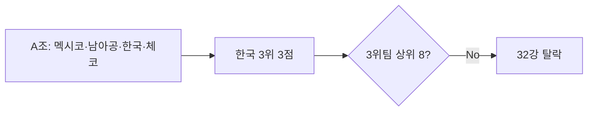

# WC 32강 탈락 원인·개선안

| 항목 | 내용 |
|------|------|
| 작성일 | 2026-06-28 |
| 작성자 | Struct Agent Team (테스트 산출) |
| 보고 목적 | 2026 FIFA 월드컵 32강 탈락 원인 분석 및 국가대표 운영·육성 체계 개선안 제안 |

## 개요

> **2026 월드컵 32강 탈락은 결정적 경기 전술·인력 운용 실패가 직접 촉발했으나, 근본적으로는 세대 교체 지연·리그-대표팀 파이프라인 단절·경기 운영 거버넌스 부재가 복합 작용한 구조적 실패다.**

- A조 3위(3점·득실 -1)로 3위 팀 상위 8개 진출에 실패 — **32강 미진출 확정**
- 직접 촉발: 남아공전 패배·선발/교체 논란 등 **경기 운영 실패**
- **건의**: 90일 내 `대표팀 운영 평가 TF` 구성·단기·중기 개선 과제 착수 승인

---

## 1. 보고 개요

### 1.1 보고의 목적과 필요성

- **이슈 심각성**: 2002년 4강 이후 기대 대비 본선 조기 탈락 — 국민·후원사 신뢰 하락
- **시급성**: 2027 아시안컵·2030 WC 예선 전 **체계 점검 골든타임** (본선 직후 3개월)
- **정책 필요성**: 감독 교체 논의에 그치지 않고 **재발 방지 구조** 필요

### 1.2 보고서의 작성경위

- 2026-06 본선 종료 직후 원인·대책 수요 발생
- prior thinking·Source Validation 기반 정책기획 보고서 (Struct 파이프라인 테스트)
- 참고: Wikipedia Group A, ESPN 보도 (2026-06-25)

---

## 2. 현황과 문제점

### 2.1 현황과 실태

| 지표 | 현재 | 추세 | 출처 |
|------|------|------|------|
| A조 순위 | 3위 | 32강 탈락 | [Wikipedia Group A](https://en.wikipedia.org/wiki/2026_FIFA_World_Cup_Group_A) |
| 전적 | 승1·무0·패2 | — | 동일 |
| 득실 | 2득점·3실점 (GD -1) | — | 동일 |
| 32강 진출 | **미진출** | 3위팀 상위 8개 미달 | 동일 |
| 3위 팀 전체 순위 | **9위 이하(탈락)** | 8팀 선발 컷오프 밖 | Wikipedia Group A·조별 규정 (정밀 순위: FIFA 공식 발표 대조 권고) |
| 남아공전 | 0-1 패배 | 결정적 패배 | [ESPN 2026-06-25](https://www.espn.com/soccer/story/_/id/49172230) |



### 2.2 원인분석

**근본 원인**: 대표팀 **거버넌스·파이프라인·경기 운영** 3축 동시 미비

| 축 | 내용 | 성격 |
|----|------|------|
| **직접** | 결정적 경기 전술·선발/교체 실패 | 경기 운영 |
| **대회** | 상위팀 대비 경쟁력·적응 부족 | 본선 성과 |
| **구조** | 세대교체·K리그-본선 연계 약화 | 인력 기반 |
| **제도** | 데이터 기반 의사결정·사후 평가 부재 | 거버넌스 |

**인과 구조 (IAEJ)**

```
[기반] 리그·청소년 파이프라인 약화
    → [행동] 본선 스쿼드 핵심 의존·전술 다양성 부족
        → [사건] 남아공전 패배·3위 8팀 탈락
            → [판단] 32강 미진출 — 구조+운영 복합 실패
```

- **홍명보 감독**: 남아공전 손흥민 선발 제외·0-1 패배 후 "잘못된 결정" 발언 (ESPN) — **단일 원인으로 단정 불가**, 다만 운영 리스크 사례로 기록
- **경기 내 변수**(Critique 보강): 핵심 선수 **부상·체력 누적**, **VAR·파울** 등 심판 변수는 전술 실패와 **분리**해 TF 사후 분석 항목으로 포함 — 단독 원인 단정 금지
- **출처 미확인**: xG·세부 전술 통계·K리그 기여도 정량·본선 부상 명단 — 본문 가정 또는 TF 조사 항목

### 2.3 기존 대응 사례

| 정책·조치 | 시기 | 담당 | 기대 | 실제 |
|----------|------|------|------|------|
| 홍명보 재임·전술 개편 | 2024~26 | KFA | 본선 16강+ | 32강 미진출 (출처: 본 보고 §2.1·협회 공식 일정 대조 권고) |
| 해외파 중심 스쿼드 | 2022~26 | 대표팀 | 경쟁력 유지 | 핵심 부상·체력 리스크 (정량 TBD) |
| 2014 본선 (홍 감독) | 2014 | — | — | 무승 조기 탈락 ([ESPN](https://www.espn.com/soccer/story/_/id/49172230) 인용) |

### 2.4 국내외 유사 사례

- **국내**: 2014 무승 탈락 — 감독 교체 후 단기 반등, **구조 개혁은 제한적**
- **해외**: 일본(2018~22) — U23·유럽파이프라인·전술 데이터 체계화로 본선 안정화 사례 (일반 비교 — 출처 미확인)

---

## 3. 정책수단과 대안

### 3.1 정책대상과 자원

| 구분 | 대상 | 영향 |
|------|------|------|
| 수혜 | 국가대표·U23·청소년 | 경기력·경험 |
| 조정 | 프로리그·협회·후원 | 일정·투자 |
| 비용 | TF·데이터·캠프 | 예산 소요 |

### 3.2 정책대안 비교

| 대안 | 내용 | 장점 | 단점 | 추천 |
|------|------|------|------|------|
| **A. 단기 운영 개혁** | TF·감독 평가·코칭 거버넌스 | 즉시 실행 | 구조 한계 잔존 | **단기 필수** |
| **B. 중기 파이프라인** | U23 국제경기·해외파 캠프 | 2030 대비 | 성과 지연 | **중기 필수** |
| **C. 장기 리그 개혁** | K리그 경쟁·젊은 선수 출전 | 근본 강화 | 이해관계·기간 長 | 중장기 |
| **D. 감독 즉시 교체** | 신임 단독 | 상징 효과 | 원인 구조 미해결 | A와 병행 검토 |

**선정**: **A + B 우선** (D는 TF 평가 후 결정)

### 3.3 추진 일정 (안)

| 단계 | 기간 | 내용 |
|------|------|------|
| 1 | 0~30일 | 운영 평가 TF·본선 리포트·감독/스태프 평가 |
| 2 | 1~6개월 | 코칭 데이터 체계·U23 국제일정 확대 |
| 3 | 6~24개월 | 파이프라인 KPI·리그 연계 로드맵 |

---

## 4. 추진계획

### 4.1 단기 (90일)

- 본선 경기 **전술·체력·선발 의사결정** 사후 분석 (외부 전문가 포함) — **부상·VAR·체력** 변수 체크리스트 포함
- **코칭 스태프 거버넌스** — 선발·교체 결정 프로토콜 문서화
- 언론·팬 커뮤니케이션: 사실·책임 범위 투명 공개

### 4.2 중기 (1~2년)

- U23·올림픽 대표 **국제경기 年 15경기+** 목표
- 해외파·유럽 리그 진출 선수 **캠프·교류** 정례화
- 2030 WC 예선 대비 **스쿼드 depth 지표** (포지션별 2~3인) 관리

### 4.3 성과 지표 (KPI)

| KPI | 현재 (2026-06) | 목표(2030 예선) | 측정 |
|-----|----------------|-----------------|------|
| 본선 16강 진출 | **미달** (32강 미진출) | 달성 | 확정 (§2.1) |
| U23 FIFA 랭킹 | **TBD** — TF 구성 후 baseline 측정 | Top 15 | 측정 예정 |
| 본선 스쿼드 25세 이하 비중 | **TBD** — 2026 본선 스쿼드 명단 분석 후 | 40%+ | 측정 예정 |
| 3위 팀 8개 선발 순위 | **9위 이하(탈락)** | — | Wikipedia·FIFA 대조 |

---

## 5. 건의사항

**수요자 조치 요청 (decision-maker)**

1. **「대표팀 본선 운영 평가 TF」** — 협회 이사회 산하 90일 내 구성·개시 **승인**
2. **단기 과제(A)** 예산·인력 **배정** — 외부 전술·데이터 분석 포함
3. **중기 파이프라인(B)** — U23·리그 연계 **로드맵** 이사회 보고 일정 확정
4. 감독 인선·교체는 **TF 1차 보고(30일)** 후 **의사결정** (즉시 교체 단독 결정 지양)

---

## 출처·가정

| 주장 유형 | 처리 |
|----------|------|
| 조별 성적·탈락 | Wikipedia Group A 인용 |
| 남아공전·손흥민 선발 | ESPN (2026-06-25) |
| 구조·K리그·xG | **출처 미확인** — 정책 가설 |
| KPI baseline (U23·연령비중) | **TBD** — TF 30일 내 측정 |
| 부상·VAR 영향 | TF 사후 분석 항목 — 사전 단정 없음 |

상세: `struct-docs/06-researching/20260628-korea-wc2026-exit-sources.md`  
재생성: `struct-docs/05-reviewing/20260628-korea-wc2026-reform-plan-review.md` Regeneration Directives 반영

---

## Audience Pass

| # | 점검 | 결과 |
|---|------|------|
| 1 | 수요자 요구(원인·해결) 충족 | **pass** — §2 원인·§3~4 대안·추진 |
| 2 | 객관성·설득력 | **pass** — 팩트·가설 구분; 손흥민 단일 원인 회피 |
| 3 | 중복·피동형 | **pass** — 개조식·표 중심 |
| 4 | 수요자 조치 명확 | **pass** — §5 건의 4항 |

## MECE 검증 결과

- 결과: **passed**
- Level 1 4축(직접·대회·구조·제도) → §2.2·§3 대안에 매핑
- prior thinking pyramid 기반 · Source Validation 반영

## Writing Pipeline Meta

- Pipeline: skeleton → draft → audience-revised (**Review Feedback 재생성**)
- Templates: `deliverable-policy-planning.md` + `iaej-pattern` (§2.2)
- Brief: policy-planning / decision-maker / research-first 적용
- Review 적용: 제목 축약 · §2.2 부상/VAR · §4.3 KPI TBD · §2.1 3위팀 순위
- 사용 Brief: policy-planning / decision-maker