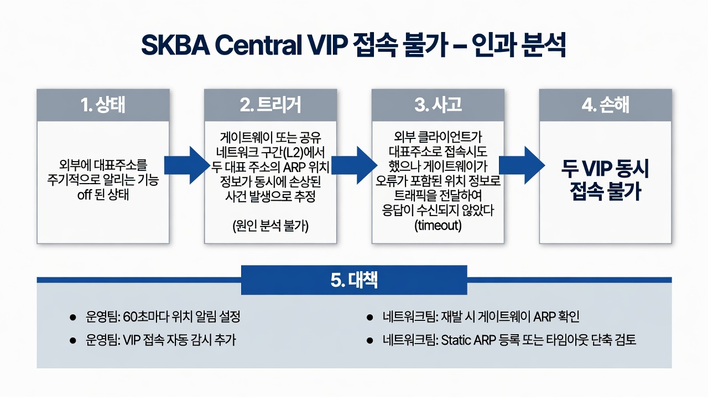

# SKBA Central VIP 접속 불가 — 근본원인 분석 및 재발방지 보고서

**대상**: 중요한 시스템 접속 주소 2개 (swarm VIP, auth VIP)

| 항목 | 내용 |
|------|------|
| 작성일 | 2026-07-02 |
| 보고 유형 | 장애 원인 분석 및 재발방지 대책 |
| 시급성 | 정상 |
| 읽는 대상 | IT 지식이 많지 않은 분 (의사결정자 수준) |

---

## 핵심 요약

원격 클라이언트에서 두 개의 중요한 대표 주소(VIP)에 동시에 접속할 수 없는 장애가 발생하였다. 개별 서버 주소는 정상이었으나, 대표 주소만 timeout이 발생하였다.

근본 원인은 게이트웨이 장비가 두 대표 주소에 대해 오래된(잘못된) 위치 정보를 보유하고 있었기 때문이다. 이로 인해 트래픽이 잘못된 목적지로 전달되었다.

이 문제가 방치된 구조적 원인은 서버 측에서 대표 주소의 위치를 주기적으로 알리는 기능(`vrrp_garp_master_refresh`)이 설정되어 있지 않았기 때문이다. 부팅 시 1회만 알리고 이후 6주간 추가 알림이 없었다.

재발 방지를 위한 주요 조치는 다음과 같다.
- 서버가 60초마다 위치 정보를 자동으로 알리도록 설정을 변경한다(운영팀 즉시 적용).
- 대표 주소의 접속 가능 여부를 자동으로 감시하는 기능을 추가한다.
- 재발 시 게이트웨이 측에서 위치 정보를 즉시 확인할 수 있도록 협조 체계를 마련한다.

즉시 실행이 필요한 조치 사항은 본 보고서 하단의 「즉시 실행 요약」을 참조하기 바란다.

---

## 인과 분석

본 장애의 원인을 상태(State) → 트리거(Trigger) → 사고(Accident) → 손해(Damage) → 대책(Countermeasures) 순으로 분석하였다. 전문 용어는 최초 등장 시 간단히 설명한다.

### 인과 분석 다이어그램



*그림 1. 인과 분석 흐름도 (상태 → 트리거 → 사고 → 손해) 및 주요 재발방지 대책 요약*

이 다이어그램은 본 절의 내용을 시각적으로 요약한 것이다.

### 1. 상태 (장애 발생 이전의 구조적 조건)

장애 발생 전부터 존재하던 위험 요인은 다음과 같다.

- 두 개의 대표 주소(VIP)는 다수의 서버가 공동으로 사용하는 주소로, 외부 요청 시 실제 서버 중 하나가 응답을 담당한다.
- 대표 주소의 위치를 외부에 알리는 Gratuitous ARP(GARP, 위치 정보 알림) 기능이 서버 부팅 시 1회만 수행되고, 이후 주기적으로 수행되지 않도록 설정되어 있었다.
- 외부 클라이언트의 트래픽은 반드시 게이트웨이(10.99.226.1)를 경유하여 라우팅된다. 게이트웨이는 수신된 위치 정보에 기반하여 목적지를 결정한다.
- 게이트웨이 장비는 수신된 ARP 정보(주소-위치 매핑)를 일정 시간(기본 4시간) 동안 그대로 유지하며, 새로운 알림이 없으면 자동으로 갱신하지 않는다.
- 장애 발생 전야(夜間) 서버 측에서는 재부팅, 서비스 재시작, 네트워크 인터페이스 장애 등의 이벤트가 발생하지 않았다.

**위험 요인**  
대표 주소의 위치 정보가 게이트웨이에서 오류 상태로 기록되면, 실제 서버는 정상 동작 중임에도 불구하고 외부에서 접속 불가로 인식된다. 서버 측에서는 이 상황을 감지하기 어렵다.

### 2. 트리거 (촉발 계기)

장애를 직접 촉발한 계기는 서버 로그에는 기록되지 않았다.

- 게이트웨이 또는 공유 네트워크 구간(L2)에서 두 대표 주소의 ARP 위치 정보가 동시에 손상된 사건이 발생한 것으로 추정된다.
- 가능한 원인으로는 게이트웨이 재부팅, 고가용성(HA) 전환, ARP 테이블 초기화, 인접 장비 재학습 등이 있다.
- 서버 측 로그에서는 해당 이벤트와 관련된 흔적이 확인되지 않았다.

**발생 시점**  
정확한 발생 시각은 현재 확인되지 않는다. 대표 주소에 대한 도달성 감시 기능이 부재하였기 때문이다.

### 3. 사고 (장애 발생 경위)

외부 클라이언트가 두 대표 주소로 접속을 시도한 결과 다음과 같은 현상이 나타났다.

- 게이트웨이가 오류가 포함된 위치 정보로 트래픽을 전달하여 응답이 수신되지 않았다(timeout).
- 개별 서버의 실제 IP 주소로는 접속이 정상적으로 이루어졌다.
- 대표 주소에 대해 위치 정보 알림(GARP)을 강제로 발송한 직후, 두 주소 모두 접속이 즉시 복구되었다.

이러한 사실(강제 위치 알림 후 즉시 복구)은 게이트웨이가 보유한 위치 정보가 오류 상태였음을 가장 직접적으로 입증한다.

### 4. 손해 (피해 내용)

- 타 서브넷 원격 클라이언트에서 두 대표 주소(swarm VIP, auth VIP)로의 접속이 불가능하였다.
- 정확한 영향 범위와 지속 시간은 대표 주소 도달성 감시 데이터가 없어 정량적으로 확인되지 않았다.
- 서버 자체의 가용성에는 영향이 없었다.

### 5. 대책 (재발 방지 대책)

| 단계 | 대책 | 담당 | 시기 | 기대 효과 |
|------|------|------|------|-----------|
| 상태 | 대표 주소의 위치 정보를 60초 주기로 자동 알리도록 설정을 변경한다. | 운영팀 (서버 담당) | 즉시 | 게이트웨이가 보유한 위치 정보의 오류를 60초 이내에 자동 교정 |
| 상태 | 대표 주소의 접속 가능 여부를 주기적으로 확인하는 도달성 감시 기능을 추가한다. | 운영팀 | 즉시 | 장애 발생 시점의 정확한 파악 및 조기 발견 |
| 상태 | 대표 주소 중복 보유 여부를 탐지하는 모니터링을 추가한다(2순위). | 운영팀 | 검토 | 분할 뇌(split-brain) 상황 조기 인지 |
| 트리거·사고 | 재발 시 게이트웨이에서 해당 주소의 ARP 정보를 즉시 조회한다. | 네트워크팀 (NW팀) | 재발 시 | 오류 위치 정보 여부 즉시 확인 및 원인 특정 |
| 트리거 | 게이트웨이의 야간 이벤트(재부팅, HA 전환, ARP 테이블 초기화) 로그를 확보한다. | 네트워크팀 | 재발 시 | 촉발 계기 파악 |
| 손해 예방 | 게이트웨이에 대표 주소를 고정 등록(Static ARP)하거나 ARP 타임아웃을 단축하는 방안을 검토한다. | 네트워크팀 | 검토 | 서버 측 주기 알림과 병행한 이중 방어 |
| 별도 | auth VIP(10.99.226.92)의 L7 연결 이상 증상에 대한 별도 원인 조사를 수행한다. | 운영팀 | 별도 | 본 장애와 무관한 하위 이슈 처리 |

상세한 설정 변경 및 확인 절차는 본 보고서 말미의 「기술 참고」를 참조한다. 

네트워크팀에는 재발 시 게이트웨이 ARP 조회 명령 실행 및 관련 이벤트 로그 제공을 요청한다.

---

## 결론

본 장애는 서버 자체의 가용성 문제는 아니었으며, 대표 주소의 위치 정보를 게이트웨이로 주기적으로 알리는 기능이 미설정된 구조적 취약점에 기인한다. 

가장 시급한 조치는 서버가 60초 주기로 위치 정보를 자동 알리도록 설정을 적용하는 것이다. 해당 조치 적용 시 동일 원인에 의한 재발 가능성을 크게 저감할 수 있다.

추가로 대표 주소의 도달성 감시 기능을 도입하고, 재발 시 원인 규명을 위한 네트워크팀과의 협조 체계를 정비할 필요가 있다. 정확한 발생 시각 및 게이트웨이 측 이벤트에 대한 추가 조사가 요구된다.

## 즉시 실행 요약

| 담당 | 조치 내용 | 우선순위 | 비고 |
|------|-----------|----------|------|
| 운영팀 (서버 담당) | 대표 주소 위치 정보의 60초 주기 자동 알림 설정 적용 | 최우선 | 재발 방지의 핵심 |
| 운영팀 (서버 담당) | 대표 주소 도달성 자동 감시 기능 추가 | 최우선 | 장애 발생 시점 파악 가능 |
| 운영팀 (서버 담당) | 대표 주소 중복 보유 감시 기능 추가 | 보통 | Split-brain 상황 대비 |
| 네트워크팀 (NW팀) | 재발 시 게이트웨이 ARP 정보 즉시 조회 | 최우선 | 원인 즉시 확인 |
| 네트워크팀 (NW팀) | 게이트웨이 야간 이벤트 로그 확보 | 중요 | 촉발 계기 파악 |
| 네트워크팀 (NW팀) | 게이트웨이 Static ARP 등록 또는 ARP 타임아웃 단축 검토 | 권장 | 이중 방어 |
| 운영팀 | auth VIP L7 연결 이상에 대한 별도 조사 수행 | 별도 | 본 장애와 무관 |

운영팀 및 네트워크팀에 대하여 상기 조치의 즉시 착수를 요청하기 바란다. 구체적인 이행 일정은 별도 협의가 필요하다.

## 기술 참고 (운영팀 및 네트워크팀용)

아래 내용은 기술 담당자용 상세 정보이며, 일반 독자는 본문까지만 참조하면 충분하다.

**1. 서버 설정 변경 (1순위 조치)**

대표 주소(VIP)를 보유한 각 서버의 `/etc/keepalived/keepalived.conf` 파일 내 `vrrp_instance` 블록에 다음 항목을 추가한다.

```
garp_master_refresh 60
garp_master_refresh_repeat 1
```

적용 절차:
- 문법 검증: `sudo keepalived -t -f /etc/keepalived/keepalived.conf`
- 설정 적용: `sudo systemctl reload keepalived`
- 주기 알림 동작 확인: `tcpdump` 등을 이용하여 60초 주기 Gratuitous ARP 발송 여부 점검 권장

**2. 대표 주소 도달성 감시 추가**

모니터링 도구(telegraf.conf)에 다음 항목을 추가하여 VIP 주소의 TCP 응답 여부를 주기적으로 확인한다.

```
[[inputs.net_response]]
  protocol = "tcp"
  address  = "10.99.226.70:443"
  timeout  = "3s"
```

auth VIP의 경우 `10.99.226.92:443`로 설정한다.

**3. 재발 시 네트워크팀 확인 항목**

게이트웨이 장비에서 다음 명령을 실행하여 현재 ARP 등록 정보를 확인한다.

```
show ip arp 10.99.226.70
show ip arp 10.99.226.92
```

정상 시 MAC 주소:
- 10.99.226.70 → 00:50:56:ac:f4:06
- 10.99.226.92 → 00:50:56:ac:a8:fa

**참고 자료**
- 원본 상세 RCA 문서: `SKBA_Central_VIP_RCA_final.md`

---

**작성**: Struct Agent Team (struct-write)

**다음 단계**  
운영팀 및 네트워크팀에 「즉시 실행 요약」에 따른 조치 착수를 요청하고, 이행 결과를 취합하여 추가 검토를 진행할 것을 제안한다. 필요 시 별도의 기술 상세 보고서를 작성할 수 있다.