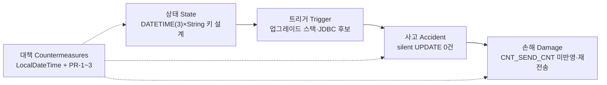

# INC-EDGEIF-IMG_CLCT_DTM-PREC — DATETIME(3)×String 잠재 결함 RCA 및 재발방지 보고

| 항목 | 내용 |
|------|------|
| 작성일 | 2026-07-15 |
| 문서 번호 | INC-EDGEIF-IMG_CLCT_DTM-PREC |
| 프로젝트 / 브랜치 | edgeif (Edge API) / RELEASE-3.0.0 |
| subType | information (장애 RCA) |
| 시급성 | **urgent (P0)** — 커밋·배포·모니터링 |
| 읽는 대상 | 개발·운영 엔지니어 (expert) |
| logicMode | stad (State → Trigger → Accident → Damage → Countermeasures) |
| 원본 PDCA | `D:/skon/ATIS/edgeif/docs/20260710_imgclctdtm-precision` (01~07) |
| Analyze 판정 | **조건부 합격 (Pass with residual risks)** |

> **【도입문】** edgeif 개발·운영팀이 2026-07 기간, AI 검사결과 Central 전송 경로(`AiInspectionSendScheduler` → `NInspectionInteractor`)에서 `IMG_CLCT_INFO_TB.CNT_SEND_CNT`가 전송 성공 후에도 갱신되지 않는 silent UPDATE 0건 장애를 확인·조치하였다. `DATETIME(3)` 식별 키의 String 왕복 잠재 결함이 업그레이드 스택 변경으로 발현된 것이며, 활성 경로 조치(LocalDateTime + PR-1~3)는 완료되었으나 **커밋·배포와 ZERO_ROW 모니터링이 즉시 필요**하다.

---

## 개요

> INC-EDGEIF-IMG_CLCT_DTM-PREC는 DATETIME(3) 식별 키를 String 동등 비교에 의존한 잠재 결함이 업그레이드 스택 변경으로 발현된 silent UPDATE 0건 장애이며, LocalDateTime 전환과 PR-1~3으로 활성 경로는 해소·재발 방지되었으나 잔여 리스크 하의 조건부 합격이므로 커밋·배포와 ZERO_ROW 모니터링이 즉시 필요하다.

- **현상**: Central 전송 성공 후에도 `CNT_SEND_CNT` UPDATE **0건** (SQLException 없음)
- **귀속**: 근본 = 설계 잠재 결함 · 발현 계기 = 업그레이드 스택 · 트리거 후보 = MariaDB Connector/J (고립 실험 미수행) · **MyBatis 단독 원인 확정 불가**
- **조치 상태**: 활성 경로 LocalDateTime + PR-1~3 완료 · 단위테스트 8 pass · Analyze **조건부 합격**
- **즉시 조치 (P0)**: (1) 커밋·배포 (2) `SEND_*_FLAG_UPDATE_ZERO_ROW` 모니터링 등록 (3) 배포 후 스모크 1건 (`INFO` + `CNT_SEND_CNT=5`)

### 원인 계층 한눈 표

| 구분 | 정의 | 본 사안 | 확정 수준 |
|------|------|---------|-----------|
| **직접 원인** | 장애 메커니즘을 즉시 설명 | `imgClctDtm2`/`imgTakenDtm2`를 String으로 SELECT → WHERE `=` 재사용 (MyBatis `StringTypeHandler` → JDBC `getString`/`setString`) | **확정** |
| **근본 원인 (잠재 결함)** | 왜 그 메커니즘이 존재했는가 | `DATETIME(3)` 식별 키를 **문자열 동등성**에 의존한 설계 · 소수 초 정밀도 + 드라이버 직렬화 종속 · ~3년 운영 | **확정에 가깝다** |
| **발현 계기 (Why now)** | 왜 지금 터졌는가 | SB 3.2.4→4.0.6 업그레이드 배포와 시간 상관 · mybatis-starter/core + **mariadb-java-client 3.3.3→3.5.8** 동시 변경 | **시간 상관 확정** |
| **유력 트리거 후보** | 런타임 표현 불일치를 만든 계층 | **MariaDB Connector/J** (문자열 DATETIME 직렬화). MyBatis는 JDBC 위임 중개, core 패치 수준 | **후보 (고립 실험 미수행)** |

> **권장 귀속 문장**: 「업그레이드가 MyBatis 버그를 만든 것이 아니라, **업그레이드 스택이 잠재 결함을 드러냈다**.」

### 장애 경로 (Series)

```text
SELECT DATETIME(3) → String 매핑 왜곡 → Central 전송 성공
  → UPDATE WHERE 불일치 → affected=0 → CNT_SEND_CNT 잔류 → 재전송/상태 꼬임
```



---

## 인과 분석 (logic: incident-causal-pattern, mode=stad)

본 장애를 **상태(State) → 트리거(Trigger) → 사고(Accident) → 손해(Damage) → 대책(Countermeasures)** 순으로 분석한다.  
**근본(잠재 결함)** 과 **발현 계기/트리거 후보**는 동일 원인으로 뭉개지 않고 단계별로 분리한다.

### 1. 상태 (State)

사고 전부터 지속된 구조·설계 조건(잠재 결함).

- **식별 키 설계**: `IMG_CLCT_INFO_TB.IMG_CLCT_DTM` / `IMG_TAKEN_DTM` = `DATETIME(3)`(밀리초)을 Java **`String`** 으로 읽고, UPDATE WHERE `=` 로 재사용
- **매핑 경로**: MyBatis `StringTypeHandler` 계열 → JDBC `ResultSet.getString` / `PreparedStatement.setString` — DATETIME을 **텍스트**로 왕복
- **이중 매핑 구조** (의도적):
  - 전송용: `DATE_FORMAT(..., '%Y%m%d%H%i%s')` → `String imgClctDtm` (초 단위, Central API)
  - 키용: `IMG_CLCT_DTM AS imgClctDtm2` → 장애 전 `String` (조치 후 `LocalDateTime`)
- **SELECT→UPDATE 동일 인스턴스**: `AIInspection` 한 객체를 조회·전송·상태 갱신에 재사용 → 키 표현 왜곡 시 실패가 은폐되기 쉬움
- **영향 Mapper (활성 3종)**:

| Mapper id | SET 요약 | 호출 시점 |
|-----------|----------|-----------|
| `updateAIInspectionResultStcd` | `CNT_SEND_CNT = 5` | Central 전송 성공 |
| `updateAIInspectionResultFail` | `CNT_SEND_CNT = 9` | Central 전송 실패 |
| `updateAIInspectionEmpty` | `IMG_ST_CD` + `CNT_SEND_CNT = 10` | 필수 필드 누락 |

- **운영 이력**: 약 **3년** 동일 패턴 운영 — 무사고 기간 ≠ 설계 안전
- **관측성 공백**: affected rows = 0 이어도 SQLException 없음 → SUCCESS-only 로깅 시 silent failure

**위험성**

- 소수 초 정밀도·JDBC 문자열 직렬화·암시적 캐스팅이 개입하면 **동일 순간이라도 표현이 달라질 수 있음**
- MariaDB `DATETIME(n)` 캐스팅은 반올림이 아닌 **절사(truncation)** — 문자열 왕복은 동등 비교 전제를 깨기 쉬움
- 애플리케이션은 “전송 성공”으로 보일 수 있어 **데이터 상태 불일치가 장기 잠복**

### 2. 트리거 (Trigger)

잠재 결함을 표면화한 촉발 계기. **근본 원인과 분리**하여 귀속한다.

#### 2.1 발현 계기 (Why now) — 업그레이드 스택

| 구성요소 | Before | After | 비고 |
|----------|--------|-------|------|
| Spring Boot | 3.2.4 | 4.0.6 | parent BOM |
| mybatis-spring-boot-starter | 3.0.3 | 4.0.1 | pom 명시 |
| mybatis (core) | 3.5.14 | 3.5.19 | **패치 수준** |
| mybatis-spring | 3.0.3 | 4.0.0 | Spring 6 / Boot 4 |
| **mariadb-java-client** | **3.3.3** | **3.5.8** | SB BOM `mariadb.version` · **minor 점프** |

- 장애 시점 배포는 **MyBatis만** 올린 배포가 아님 — Boot + MyBatis starter/core/spring + **MariaDB JDBC** 한 묶음
- 비즈니스 경로 소스(키 매핑 로직) 변경 없음 전제 · Boot 4 호환 소스 변경은 본 키 매핑과 무관
- **시간 상관**: 업그레이드 배포 후 장애 관측

#### 2.2 유력 트리거 후보 — MariaDB Connector/J

| 근거 | 설명 |
|------|------|
| 책임 경계 | `getString`/`setString`의 DATETIME 문자열 표현은 **드라이버** 영역 |
| 버전 점프 | 3.3.3 → 3.5.8 (MyBatis core 패치 대비 큼) |
| MyBatis 역할 | String 경로에서 JDBC API를 호출하는 **중개 계층** |
| JSR-310 | MyBatis 3.4.5+ 기본 지원 — “시간 타입 지원이 새로 생겨 깨진” 시나리오와 불일치 |

#### 2.3 MyBatis 단독 원인 — 확정 불가

| 판정 | 이유 |
|------|------|
| **확정 불가** | core 3.5.14→3.5.19 패치 수준 + String 경로는 JDBC 위임 |
| 고립 실험 A/B/C | **미수행** → JDBC pin / MyBatis pin / 구스택 fixture 비교 없음 |
| 잘못된 해석 기각 | “3년 안전 코드 + MyBatis가 버그를 신설” → 잠재 결함 해석으로 기각 |

**시점·조건**: Spring Boot 3.2.4→4.0.6 업그레이드 스택 배포 이후 · 문자열 DATETIME 표현 불일치가 WHERE 동등에 도달한 런타임 조건.

### 3. 사고 (Accident)

트리거로 직접 발생한 오류·장애 경위.

#### 3.1 발생 경로 (코드 기준)

```text
AiInspectionSendScheduler
  └─ NInspectionInteractor.sendAIInspectionResult()
       ├─ getAIInspectionComplete()                 -- SELECT 1건 (AIInspection)
       ├─ (invalid) updateAIInspectionEmpty()
       ├─ centralNWGateway.aiInspectionResultRequest(...)
       └─ saveAIInpectionStateAndHistory(...)
            ├─ 성공 → updateAIInspectionResultStcd   -- 문제 UPDATE
            └─ 실패 → updateAIInspectionResultFail
```

#### 3.2 관측 데이터 (재현 근거)

| 계층 | 값 |
|------|-----|
| DB 저장 (`DATETIME(3)`) | `2026-07-09 14:52:34.074` |
| Java String `imgClctDtm2` | `2026-07-09 14:52:34.73000` |
| 비교 | **소수부 숫자 자체가 다름** (단순 패딩 `.074` vs `.074000` 아님) |

→ `WHERE IMG_CLCT_DTM = ?` 불일치 → **affected rows = 0** · SQLException 없음 = **silent**.

#### 3.3 대표 SQL 패턴

```sql
UPDATE IMG_CLCT_INFO_TB /*InspectionMapper.updateAIInspectionResultStcd*/
SET CNT_SEND_CNT = 5
WHERE
    IMG_CLCT_DTM    = #{imgClctDtm2}
    AND CORNER_ID     = #{cornerId}
    AND CELL_ID       = #{cellId}
    AND IMG_TAKEN_DTM = #{imgTakenDtm2}
```

#### 3.4 악화·확산 경로

1. SELECT로 읽은 String 키가 DB 원값과 불일치
2. Central 전송은 정상 완료 (비즈니스 성공 착시)
3. 상태 UPDATE 0건 → `CNT_SEND_CNT` 미반영 (기대 5/9/10 미도달)
4. 스케줄러가 동일 행을 재전송 대상으로 재선정 가능 (상태 꼬임)

### 4. 손해 (Damage)

| 구분 | 내용 |
|------|------|
| **데이터 상태** | `IMG_CLCT_INFO_TB.CNT_SEND_CNT` 미갱신 — 성공=5 / 실패=9 / 필수값누락=10 기대 미반영 |
| **서비스 영향** | AI 검사결과 Central 전송 후 수집 이미지 상태 반영 실패 · 재전송 대상 잔류 |
| **탐지성** | 애플리케이션 예외 없이 SQL 성공 + 0건 → **silent failure** · 1선 인지 지연 |
| **잔여 운영 리스크 (R1)** | Stcd 0-row 시 `CNT_SEND_CNT=0` 유지 → **Central 재전송 가능** (현 정책 WARN-only 수용) |
| **정량 범위** | 본 보고서 시점 기준 전수 영향 건수·지속 시간은 원본 incident 관측 샘플 중심 (대표 불일치 1건 명시) |

### 5. 대책 (Countermeasures)

활성 경로 기준으로 **장애 해소(LocalDateTime)** + **재발 방지 PR-1~3** 을 반영. 레거시 Te\* 는 Non-Goal.

#### 5.1 장애 해소 — typed temporal 왕복

| 항목 | 장애 전 | 조치 후 |
|------|---------|---------|
| `AIInspection.imgClctDtm2` / `imgTakenDtm2` | `String` | **`LocalDateTime`** |
| MyBatis 처리 | `StringTypeHandler` → get/setString | `LocalDateTimeTypeHandler` → `rs.getObject(..., LocalDateTime.class)` |
| 전송용 `imgClctDtm` | String (DATE_FORMAT 초단위) | **이중 매핑 유지** (API 계약) |
| 의미 | 드라이버 문자열 직렬화 의존 | **시간 타입 객체 왕복** — 잠재 결함 제거 |

> 조치 성격: MyBatis 버전 버그 수정이 아니라 **잠재 결함 제거**. 버전 롤백만으로는 근본 해결이 아님.

#### 5.2 PR-1 ~ PR-3 및 단계 매핑

| 단계 | 대책 | 담당·시기 | 재발 차단 |
|------|------|----------|:--------:|
| **상태** | 키 필드 `LocalDateTime` 전환 · 전송용 String 이중 매핑 유지 | 개발 · 조치 완료 | **高** |
| **상태** | **PR-1** Mapper: 3 UPDATE `parameterType=AIInspection` · Fail/Empty/Stcd 모두 `int` 반환 | 개발 · 완료 | 中 |
| **상태** | **PR-3** incident §6 + `.grok/rules` DATETIME 키 String 금지 제도화 | 개발 · 완료 | 中–高 |
| **트리거** | 업그레이드 시 temporal 키 타입·드라이버 문자열 의존 경로 점검 (rules 체크리스트) | 개발 · 상시 | 中 |
| **사고** | **PR-2** `logAiInspectionUpdate`: 0→`ZERO_ROW` WARN · 1→INFO · 다건→`MULTI_ROW` WARN · 예외 없음 | 개발 · 완료 | **高** (탐지) |
| **사고** | 단위테스트 T1~T7 (`InspectionDsProviderTest`) + `AIInspectionTest` — **8 pass** (2026-07-10) | 개발 · 완료 | 高 |
| **손해** | 운영 검색 키워드 문서화 · ZERO_ROW 모니터링 (Act P0) | 개발·운영 · **즉시** | 中–高 |
| **손해** | 재전송 불허 시 hard-fail / dead-letter (Act P3, 선택) | 개발·운영 · 후속 | 선택 |

#### 5.3 PR-2 로그 계약 (as-built)

```text
updateCnt == 0  → log.warn  {action}_ZERO_ROW
updateCnt != 1  → log.warn  {action}_MULTI_ROW   (0 제외 다건)
updateCnt == 1  → log.info  {action}             (suffix _SUCCESS 없음)
예외 throw 없음 (Gateway void, 스케줄 루프 유지 — KD-2 WARN-only)
```

| 메서드 | action 토큰 |
|--------|-------------|
| Stcd | `SEND_SUCCESS_FLAG_UPDATE` |
| Fail | `SEND_FAIL_FLAG_UPDATE` |
| Empty | `SEND_EXCLUDE_FLAG_UPDATE` |

#### 5.4 재발 시나리오 재평가

| 시나리오 | Do 이전 | Do 이후 |
|----------|---------|---------|
| String 직렬화로 WHERE 0건 | 발생 (본 장애) | **구조적 차단** (`LocalDateTime`) |
| 0건이 SUCCESS-only 로깅 | 탐지 지연 | **차단** (ZERO_ROW WARN + 테스트) |
| parameterType 혼동 재도입 | 문서 위험 | **완화** (`AIInspection` 정합) |
| 0건 후 스케줄 재전송 | 가능 | **여전히 가능** (의도적 WARN-only) — R1 |

#### 5.5 Audit 범위 (잔존)

| 우선순위 | 대상 | 상태 |
|----------|------|------|
| **P0** | 활성 3 UPDATE (Stcd/Fail/Empty) | **완료** |
| **P1** | 레거시 `updateTeAIInspectionResultStCd`, `updateTeInspectionResultFail` (String equality, **호출 0**) | 잔존 · Non-Goal |
| **P2** | 관찰 항목 | 관찰 |
| Non-Goal | Te\* 전면 정리 | Act P3 후보 |

---

## 결론

### 평가

- 본 장애는 **애플리케이션 예외형 장애가 아닌 silent UPDATE 0건**이며, 직접 원인은 DATETIME 키의 **String 왕복**, 근본 원인은 **문자열 동등성 의존 설계(잠재 결함)** 이다.
- “Why now”는 **업그레이드 스택 전체**와 시간 상관; 런타임 트리거는 **MariaDB Connector/J 후보**이며 **MyBatis 단독 원인으로 확정할 수 없다**.
- 활성 경로 Do(LocalDateTime + PR-1~3)는 범위 내 DoD를 충족한다 (단위테스트 8 pass). Analyze 판정은 **조건부 합격 (Pass with residual risks)**.
- 조치 코드가 **미커밋·미배포**이면 운영 반영이 되지 않으므로, 기술 해소와 별도로 **Act P0가 즉시 행동**이다.

### 잔여 리스크 (R1~R6)

| ID | 내용 | 심각도 | 완화·Act |
|----|------|--------|----------|
| **R1** | Stcd 0-row 시 `CNT_SEND_CNT=0` 유지 → **Central 재전송 가능** (WARN only 수용) | **Medium–High** | ZERO_ROW 모니터링; 불허 시 hard-fail/dead-letter (P3) |
| **R2** | C-2 Testcontainers DATETIME(3) 통합 테스트 보류 | Medium | Act P2 |
| **R3** | 레거시 Te\* String equality 잔존 (호출 0) | Low | Act P3 |
| **R4** | ZERO_ROW 알림 임계 미정 | Low–Medium | SRE 협의 |
| **R5** | 커밋·배포 필요 | 프로세스 | **Act P0** |
| **R6** | Design DoD 문구 vs as-built 로그 키워드 드리프트 | Low | Act P1 |

### 대응·대책 요약

1. **구조 차단**: `LocalDateTime` TypeHandler 왕복 (상태 단계)
2. **탐지**: ZERO_ROW / MULTI_ROW WARN + T1~T7 (사고 단계)
3. **제도**: rules DATETIME 키 String 금지 + incident 운영 키워드 (상태·손해 단계)
4. **즉시 운영**: 커밋·배포 + 모니터링 + 스모크 (아래 Act P0)

### 고려사항

- 고립 실험 A/B/C 미수행 → 트리거 계층 단정 금지; 보고·릴리스 노트는 **잠재 결함 + 업그레이드 스택 발현** 표현 사용
- R1 재전송은 **의도적 정책(WARN-only)** — 비즈니스 불허 시 hard-fail 전환 필요
- 전체 `mvn test`·배포 스모크는 Analyze 범위 외 → **배포 전/후 Check** 로 수행

---

## 즉시 조치 · Act (요청 행동)

`requestedActionRequired: true` — 개발·운영 즉시 수행 항목.

### Act P0 (즉시 · urgent)

| # | 담당 | 조치 | 완료 기준 |
|---|------|------|-----------|
| 1 | **개발** | 변경 파일 **커밋·배포** · 릴리스 노트에 운영 키워드 포함 | 운영 서버 반영 |
| 2 | **운영/SRE** | `SEND_*_FLAG_UPDATE_ZERO_ROW` (및 `*_MULTI_ROW`) **모니터링/대시보드 등록** | 검색·알림 파이프라인 동작 |
| 3 | **QA/개발** | 배포 후 스모크 **1건**: `SEND_SUCCESS_FLAG_UPDATE` **INFO** + DB `CNT_SEND_CNT=5` | 로그·DB 일치 확인 |

### 운영 핸드오프 — as-built 검색 키워드

| 정상 | 이상 (WARN) |
|------|-------------|
| `SEND_SUCCESS_FLAG_UPDATE` | `SEND_SUCCESS_FLAG_UPDATE_ZERO_ROW` / `*_MULTI_ROW` |
| `SEND_FAIL_FLAG_UPDATE` | `SEND_FAIL_FLAG_UPDATE_ZERO_ROW` / `*_MULTI_ROW` |
| `SEND_EXCLUDE_FLAG_UPDATE` | `SEND_EXCLUDE_FLAG_UPDATE_ZERO_ROW` / `*_MULTI_ROW` |

### Act P1~P3 (후속)

| 우선순위 | 항목 | 담당 제안 |
|----------|------|-----------|
| **P1** | Design DoD 문구를 as-built 로그 키워드에 맞게 정리 (문서 드리프트 R6) | 개발 |
| **P2** | C-2 Testcontainers DATETIME(3) SELECT→UPDATE 통합 테스트 (R2) | 개발 |
| **P3** | 재전송 불허 시 hard-fail/dead-letter · 레거시 Te\* 삭제 또는 LocalDateTime화 (R1/R3) | 개발·운영 |

### 배포 전/후 Check 체크리스트

| # | 항목 | 담당 |
|---|------|------|
| 1 | 커밋·릴리스 노트에 `SEND_*_FLAG_UPDATE_*` 키워드 포함 | 개발 |
| 2 | ZERO_ROW 검색 파이프라인/대시보드 등록 | 운영/SRE |
| 3 | 스모크: AI 전송 1건 → INFO + `CNT_SEND_CNT=5` | QA/개발 |
| 4 | (가능 시) DATETIME(3) 밀리초 행 1건 수동 검증 | QA |
| 5 | 레거시 Te\* 미사용 재확인 (스케줄/설정) | 개발 |

---

## 참고·첨부

### 원본 PDCA 문서

| 단계 | 문서 |
|------|------|
| Incident | `docs/20260710_imgclctdtm-precision/01-incident.md` |
| Audit | `docs/20260710_imgclctdtm-precision/02-audit.md` |
| Plan | `docs/20260710_imgclctdtm-precision/03-plan.md` |
| Design | `docs/20260710_imgclctdtm-precision/04-design.md` |
| Do | `docs/20260710_imgclctdtm-precision/05-do.md` |
| Analyze | `docs/20260710_imgclctdtm-precision/06-analyze.md` |
| RCA 보충 (업그레이드 귀속) | `docs/20260710_imgclctdtm-precision/07-rca-upgrade-attribution.md` |

### 기술 근거 (공식 문서 요지)

- MariaDB `DATETIME(n)`: fractional seconds · 정밀도 축소 시 **truncation** ([MariaDB DATETIME](https://mariadb.com/docs/server/reference/data-types/date-and-time-data-types/datetime.md), [Microseconds in MariaDB](https://mariadb.com/docs/server/reference/sql-functions/date-time-functions/microseconds-in-mariadb.md))
- MyBatis TypeHandler / JSR-310: `LocalDateTimeTypeHandler` → JDBC typed get/set ([MyBatis configuration](https://mybatis.org/mybatis-3/configuration.html))
- 버전 델타 출처: `docs/springboot-upgrade-report.md`, Spring Boot BOM, Maven Central mybatis-spring-boot parent POM

### Prior Thinking

- `struct-docs/01-thinking/20260715-edgeif-imgclctdtm-precision-rca-thinking.md`
